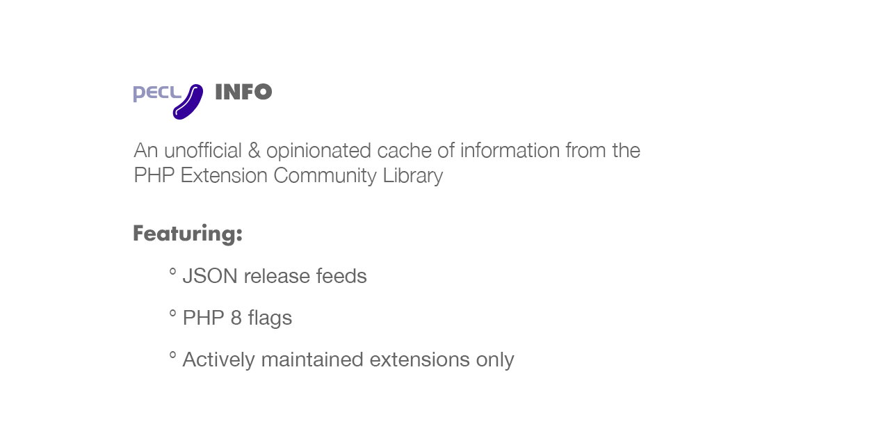

# PECL Info

> An opinionated cache of data from the PHP Extension Community Library




Questions & answers are below the listings. Packages marked with :eight: have a mention of PHP 8 somewhere in their release notes.


## Relevant Extensions (113)

### Authentication (2)

<details><summary>krb5&nbsp; :eight:</summary>
<p>Features:</p>

```
+ An interface for maintaining credential caches (KRB5CCache),
   that can be used for authenticating against a kerberos5 realm
+ Bindings for nearly the complete GSSAPI (RFC2744)
+ The administrative interface (KADM5)
+ Support for HTTP Negotiate authentication via GSSAPI

Documentation:
+ see docs/ for the API documentation
+ there are several pieces of example code in the examples/ directory
+ see below for install instructions
```
<p><ul>
<li>License: MIT</li>
<li>Latest Release: <a href="https://pecl.php.net/get/krb5-1.2.4">1.2.4</a> on 16 Mar 2025</li>
<li>Release data in JSON: <a href="data/packages/krb5.json">krb5.json</a></li>
<li><a href="https://pecl.php.net/packages/krb5">krb5 on PECL</a></li>
<li><a href="https://github.com/php/pecl-authentication-krb5">:sparkles: Source</a> &nbsp; <a href="https://pecl.php.net/package-stats.php?pid=884&rid=&cid=1">:bar_chart: Stats</a></li>
</ul></p><hr />
</details>
<details><summary>PAM&nbsp; :eight:</summary>
<p>PAM integration</p>

```
This extension provides PAM (Pluggable Authentication Modules) integration. PAM is a
system of libraries that handle the authentication tasks of applications and services. The
library provides a stable API for applications to defer to for authentication tasks.
```
<p><ul>
<li>License: PHP-3.01</li>
<li>Latest Release: <a href="https://pecl.php.net/get/PAM-2.2.5">2.2.5</a> on 22 Sep 2023</li>
<li>Release data in JSON: <a href="data/packages/pam.json">pam.json</a></li>
<li><a href="https://pecl.php.net/packages/PAM">PAM on PECL</a></li>
<li><a href="https://github.com/amishmm/php-pam/blob/master/README">:book: Documentation</a> &nbsp; <a href="https://github.com/amishmm/php-pam/">:sparkles: Source</a> &nbsp; <a href="https://github.com/amishmm/php-pam/issues">:lady_beetle: Issues</a> &nbsp; <a href="https://pecl.php.net/package-stats.php?pid=667&rid=&cid=1">:bar_chart: Stats</a></li>
</ul></p><hr />
</details>

***
### Benchmarking (4)

<details><summary>datadog_trace&nbsp; :eight:</summary>
<p>APM and distributed tracing for PHP</p>

```
The Datadog PHP Tracer brings APM and distributed tracing to PHP.
```
<p><ul>
<li>License: BSD-3-Clause</li>
<li>Latest Release: <a href="https://pecl.php.net/get/datadog_trace-1.9.0">1.9.0</a> on 09 May 2025</li>
<li>Release data in JSON: <a href="data/packages/datadog_trace.json">datadog_trace.json</a></li>
<li><a href="https://pecl.php.net/packages/datadog_trace">datadog_trace on PECL</a></li>
<li></li>
</ul></p><hr />
</details>
<details><summary>excimer&nbsp; :eight:</summary>
<p>Interrupting timer and low-overhead sampling profiler</p>

```
Calls a user-defined callback when a one-shot or periodic timer expires. Also a sampling
profiler backend, which aggregates backtraces collected by a periodic timer.
```
<p><ul>
<li>License: Apache-2.0</li>
<li>Latest Release: <a href="https://pecl.php.net/get/excimer-1.2.4">1.2.4</a> on 19 May 2025</li>
<li>Release data in JSON: <a href="data/packages/excimer.json">excimer.json</a></li>
<li><a href="https://pecl.php.net/packages/excimer">excimer on PECL</a></li>
<li><a href="https://www.mediawiki.org/wiki/Excimer">:house: Home</a> &nbsp; <a href="https://github.com/wikimedia/excimer">:sparkles: Source</a> &nbsp; <a href="https://phabricator.wikimedia.org/tag/excimer/">:lady_beetle: Issues</a> &nbsp; <a href="https://pecl.php.net/package-stats.php?pid=1057&rid=&cid=2">:bar_chart: Stats</a></li>
</ul></p><hr />
</details>
<details><summary>memprof&nbsp; :eight:</summary>
<p>Memory profiler</p>

```
Memprof is a fast and accurate memory profiler that can be used to find the cause of
memory leaks in PHP applications.
```
<p><ul>
<li>License: MIT</li>
<li>Latest Release: <a href="https://pecl.php.net/get/memprof-3.1.0">3.1.0</a> on 24 Feb 2025</li>
<li>Release data in JSON: <a href="data/packages/memprof.json">memprof.json</a></li>
<li><a href="https://pecl.php.net/packages/memprof">memprof on PECL</a></li>
<li><a href="https://github.com/arnaud-lb/php-memory-profiler">:house: Home</a> &nbsp; <a href="https://github.com/arnaud-lb/php-memory-profiler">:sparkles: Source</a> &nbsp; <a href="https://pecl.php.net/package-stats.php?pid=946&rid=&cid=2">:bar_chart: Stats</a></li>
</ul></p><hr />
</details>
<details><summary>scoutapm&nbsp; :eight:</summary>
<p>Native Extension Component for ScoutAPM's PHP Agent</p>

```
ScoutAPM's extension for PHP provides additional capabilities to application monitoring
over just using the base PHP userland library.
```
<p><ul>
<li>License: MIT</li>
<li>Latest Release: <a href="https://pecl.php.net/get/scoutapm-1.10.0">1.10.0</a> on 01 Dec 2023</li>
<li>Release data in JSON: <a href="data/packages/scoutapm.json">scoutapm.json</a></li>
<li><a href="https://pecl.php.net/packages/scoutapm">scoutapm on PECL</a></li>
<li><a href="https://docs.scoutapm.com/#php-agent">:book: Documentation</a> &nbsp; <a href="https://scoutapm.com">:house: Home</a> &nbsp; <a href="https://github.com/scoutapp/scout-apm-php-ext">:sparkles: Source</a> &nbsp; <a href="https://github.com/scoutapp/scout-apm-php-ext/issues">:lady_beetle: Issues</a> &nbsp; <a href="https://pecl.php.net/package-stats.php?pid=1041&rid=&cid=2">:bar_chart: Stats</a></li>
</ul></p><hr />
</details>

***
### Caching (4)

<details><summary>APCu&nbsp; :eight:</summary>
<p>APCu - APC User Cache</p>

```
APC User Caching
```
<p><ul>
<li>License: PHP-3.01</li>
<li>Latest Release: <a href="https://pecl.php.net/get/APCu-5.1.24">5.1.24</a> on 21 Sep 2024</li>
<li>Release data in JSON: <a href="data/packages/apcu.json">apcu.json</a></li>
<li><a href="https://pecl.php.net/packages/APCu">APCu on PECL</a></li>
<li><a href="https://php.net/apcu">:book: Documentation</a> &nbsp; <a href="https://github.com/krakjoe/apcu">:sparkles: Source</a> &nbsp; <a href="https://github.com/krakjoe/apcu/issues">:lady_beetle: Issues</a> &nbsp; <a href="https://pecl.php.net/package-stats.php?pid=944&rid=&cid=3">:bar_chart: Stats</a></li>
</ul></p><hr />
</details>
<details><summary>immutable_cache&nbsp; :eight:</summary>
<p>immutable_cache - an shared memory cache of immutable values</p>

```
immutable_cache - an shared memory cache of immutable values. Based on APCu.
```
<p><ul>
<li>License: PHP-3.01</li>
<li>Latest Release: <a href="https://pecl.php.net/get/immutable_cache-6.1.0">6.1.0</a> on 01 Dec 2022</li>
<li>Release data in JSON: <a href="data/packages/immutable_cache.json">immutable_cache.json</a></li>
<li><a href="https://pecl.php.net/packages/immutable_cache">immutable_cache on PECL</a></li>
<li><a href="https://github.com/TysonAndre/immutable_cache-pecl">:house: Home</a> &nbsp; <a href="https://github.com/TysonAndre/immutable_cache-pecl">:sparkles: Source</a> &nbsp; <a href="https://pecl.php.net/package-stats.php?pid=1076&rid=&cid=3">:bar_chart: Stats</a></li>
</ul></p><hr />
</details>
<details><summary>memcache&nbsp; :eight:</summary>
<p>memcached extension</p>

```
Memcached is a caching daemon designed especially for 
    dynamic web applications to decrease database load by 
    storing objects in memory.
    This extension allows you to work with memcached through
    handy OO and procedural interfaces.
    The extension allows use to store sessions in memcached via memcache.
```
<p><ul>
<li>License: PHP-3.01</li>
<li>Latest Release: <a href="https://pecl.php.net/get/memcache-8.2">8.2</a> on 30 Apr 2023</li>
<li>Release data in JSON: <a href="data/packages/memcache.json">memcache.json</a></li>
<li><a href="https://pecl.php.net/packages/memcache">memcache on PECL</a></li>
<li><a href="http://www.php.net/memcache">:book: Documentation</a> &nbsp; <a href="https://github.com/websupport-sk/pecl-memcache">:sparkles: Source</a> &nbsp; <a href="https://github.com/websupport-sk/pecl-memcache/issues">:lady_beetle: Issues</a> &nbsp; <a href="https://pecl.php.net/package-stats.php?pid=294&rid=&cid=3">:bar_chart: Stats</a></li>
</ul></p><hr />
</details>
<details><summary>memcached&nbsp; :eight:</summary>
<p>PHP extension for interfacing with memcached via libmemcached library</p>

```
This extension uses libmemcached library to provide API for communicating with memcached
servers.
```
<p><ul>
<li>License: PHP-3.01</li>
<li>Latest Release: <a href="https://pecl.php.net/get/memcached-3.3.0">3.3.0</a> on 17 Oct 2024</li>
<li>Release data in JSON: <a href="data/packages/memcached.json">memcached.json</a></li>
<li><a href="https://pecl.php.net/packages/memcached">memcached on PECL</a></li>
<li><a href="https://php.net/memcached">:book: Documentation</a> &nbsp; <a href="https://github.com/php-memcached-dev/php-memcached">:house: Home</a> &nbsp; <a href="https://github.com/php-memcached-dev/php-memcached">:sparkles: Source</a> &nbsp; <a href="https://github.com/php-memcached-dev/php-memcached/issues">:lady_beetle: Issues</a> &nbsp; <a href="https://pecl.php.net/package-stats.php?pid=847&rid=&cid=3">:bar_chart: Stats</a></li>
</ul></p><hr />
</details>

***
### Configuration (1)

<details><summary>zookeeper&nbsp; :eight:</summary>
<p>PHP extension for interfacing with Apache ZooKeeper</p>

```
This extension provides API for communicating with ZooKeeper service.
```
<p><ul>
<li>License: PHP-3.01</li>
<li>Latest Release: <a href="https://pecl.php.net/get/zookeeper-1.2.2">1.2.2</a> on 02 Jan 2025</li>
<li>Release data in JSON: <a href="data/packages/zookeeper.json">zookeeper.json</a></li>
<li><a href="https://pecl.php.net/packages/zookeeper">zookeeper on PECL</a></li>
<li><a href="https://secure.php.net/manual/en/book.zookeeper.php">:book: Documentation</a> &nbsp; <a href="https://github.com/php-zookeeper/php-zookeeper">:house: Home</a> &nbsp; <a href="https://github.com/php-zookeeper/php-zookeeper">:sparkles: Source</a> &nbsp; <a href="https://github.com/php-zookeeper/php-zookeeper/issues">:lady_beetle: Issues</a> &nbsp; <a href="https://pecl.php.net/package-stats.php?pid=868&rid=&cid=4">:bar_chart: Stats</a></li>
</ul></p><hr />
</details>

***
### Database (14)

<details><summary>couchbase&nbsp; :eight:</summary>
<p>Couchbase Server PHP extension</p>

```
The PHP client library provides fast access to documents stored in a Couchbase Server.
```
<p><ul>
<li>License: Apache-2.0</li>
<li>Latest Release: <a href="https://pecl.php.net/get/couchbase-4.2.7">4.2.7</a> on 18 Mar 2025</li>
<li>Release data in JSON: <a href="data/packages/couchbase.json">couchbase.json</a></li>
<li><a href="https://pecl.php.net/packages/couchbase">couchbase on PECL</a></li>
<li><a href="https://docs.couchbase.com/php-sdk/current/hello-world/start-using-sdk.html">:book: Documentation</a> &nbsp; <a href="https://docs.couchbase.com/php-sdk/current/project-docs/sdk-release-notes.html">:house: Home</a> &nbsp; <a href="https://github.com/couchbase/php-couchbase">:sparkles: Source</a> &nbsp; <a href="https://issues.couchbase.com/browse/PCBC">:lady_beetle: Issues</a> &nbsp; <a href="https://pecl.php.net/package-stats.php?pid=922&rid=&cid=7">:bar_chart: Stats</a></li>
</ul></p><hr />
</details>
<details><summary>ibm_db2&nbsp; :eight:</summary>
<p>Extension for IBM Db2 (LUW/i/z) and other compatible databases</p>

```
ibm_db2 provides access to DB2 and compatible databases on PHP.
  It uses a procedural interface. (PDO users should use PDO_IBM instead.)
  
  The following software is supported without any additional licenses:
  - IBM Db2 (Linux/Unix/Windows)
  - IBM Db2 for i (running on IBM i)
  - Apache Derby
  
  The following software may require additional licenses on the database:
  - IBM Db2 Connect for i (for using Db2 for i from LUW)
  - IBM Db2 Connect for z (for using Db2 for z from LUW)
  
  Note that for IBM i, IBM and Seiden Group recommend new applications use ODBC instead.
```
<p><ul>
<li>License: Apache-2.0</li>
<li>Latest Release: <a href="https://pecl.php.net/get/ibm_db2-2.2.2">2.2.2</a> on 01 Nov 2024</li>
<li>Release data in JSON: <a href="data/packages/ibm_db2.json">ibm_db2.json</a></li>
<li><a href="https://pecl.php.net/packages/ibm_db2">ibm_db2 on PECL</a></li>
<li><a href="https://php.net/ibm_db2">:book: Documentation</a> &nbsp; <a href="https://github.com/php/pecl-database-ibm_db2">:sparkles: Source</a> &nbsp; <a href="https://github.com/php/pecl-database-ibm_db2/issues">:lady_beetle: Issues</a> &nbsp; <a href="https://pecl.php.net/package-stats.php?pid=440&rid=&cid=7">:bar_chart: Stats</a></li>
</ul></p><hr />
</details>
<details><summary>mongodb&nbsp; :eight:</summary>
<p>MongoDB driver for PHP</p>

```
The purpose of this driver is to provide exceptionally thin glue between MongoDB
and PHP, implementing only fundamental and performance-critical components
necessary to build a fully-functional MongoDB driver.
```
<p><ul>
<li>License: Apache-2.0</li>
<li>Latest Release: <a href="https://pecl.php.net/get/mongodb-2.0.0">2.0.0</a> on 10 Apr 2025</li>
<li>Release data in JSON: <a href="data/packages/mongodb.json">mongodb.json</a></li>
<li><a href="https://pecl.php.net/packages/mongodb">mongodb on PECL</a></li>
<li><a href="https://www.php.net/mongodb">:book: Documentation</a> &nbsp; <a href="https://www.mongodb.com/docs/drivers/php-drivers/">:house: Home</a> &nbsp; <a href="https://github.com/mongodb/mongo-php-driver">:sparkles: Source</a> &nbsp; <a href="https://jira.mongodb.org/browse/PHPC">:lady_beetle: Issues</a> &nbsp; <a href="https://pecl.php.net/package-stats.php?pid=981&rid=&cid=7">:bar_chart: Stats</a></li>
</ul></p><hr />
</details>
<details><summary>mysql_xdevapi</summary>
<p>MySQL X DevAPI for PHP</p>

```
The X DevAPI is the new common API for MySQL Connectors built on the X Protocol introduced in MySQL 5.7.12.

The X DevAPI wraps powerful concepts in a simple API.
* A new high-level session concept enables you to write code that can transparently scale from single MySQL Server to a multiple server environment.
* Read operations are simple and easy to understand.

The X DevAPI introduces a new, modern and easy-to-learn way to work with your data.
* Documents are stored in Collections and have their dedicated CRUD operation set.
* Work with your existing domain objects or generate code based on structure definitions for strictly typed languages.
* Focus is put on working with data via CRUD operations. See Section 3.1, “CRUD Operations Overview”.
* Modern practices and syntax styles are used to get away from traditional SQL-String-Building. See Chapter 10, Building Expressions.
```
<p><ul>
<li>License: PHP-3.01</li>
<li>Latest Release: <a href="https://pecl.php.net/get/mysql_xdevapi-8.0.30">8.0.30</a> on 26 Jul 2022</li>
<li>Release data in JSON: <a href="data/packages/mysql_xdevapi.json">mysql_xdevapi.json</a></li>
<li><a href="https://pecl.php.net/packages/mysql_xdevapi">mysql_xdevapi on PECL</a></li>
<li><a href="http://docs.php.net/manual/en/book.mysql-xdevapi.php">:book: Documentation</a> &nbsp; <a href="http://docs.php.net/manual/en/book.mysql-xdevapi.php">:house: Home</a> &nbsp; <a href="https://github.com/php/pecl-database-mysql_xdevapi">:sparkles: Source</a> &nbsp; <a href="https://bugs.mysql.com/search.php?bug_type[]=Server%3A+DocStore&cmd=display">:lady_beetle: Issues</a> &nbsp; <a href="https://pecl.php.net/package-stats.php?pid=1002&rid=&cid=7">:bar_chart: Stats</a></li>
</ul></p><hr />
</details>
<details><summary>mysqlnd_krb</summary>
<p>Kerberos authentication plugin for mysqlnd</p>

```
The mysqlnd_krb extension is an authentication 
plugin for mysqlnd that enables connections to MySQL accounts
that use Kerberos authentication.

If a MySQL account is configured with Kerberos authentication
(using `IDENTIFIED WITH kerberos_authentication` clause
of `CREATE USER`, see [1]) then normally `mysqlnd` will not
be able to connect to such an account. With this plugin such
connections are possible provided that user has appropriate
tickets loaded into the Kerberos ticket cache (in this case
no password is needed in the connection data).

If a ticket for the MySQL service is not present in the cache
the plugin can fetch the required ticket from Kerberos provided
that user principal's password is given in the connection data.

[1] https://dev.mysql.com/doc/refman/8.0/en/kerberos-pluggable-authentication.html
```
<p><ul>
<li>License: PHP-3.01</li>
<li>Latest Release: <a href="https://pecl.php.net/get/mysqlnd_krb-1.0.0">1.0.0</a> on 02 Aug 2023</li>
<li>Release data in JSON: <a href="data/packages/mysqlnd_krb.json">mysqlnd_krb.json</a></li>
<li><a href="https://pecl.php.net/packages/mysqlnd_krb">mysqlnd_krb on PECL</a></li>
<li><a href="https://pecl.php.net/package-stats.php?pid=1078&rid=&cid=7">:bar_chart: Stats</a></li>
</ul></p><hr />
</details>
<details><summary>oci8&nbsp; :eight:</summary>
<p>Extension for Oracle Database</p>

```
The OCI8 extension lets you access Oracle Database.

Use 'pecl install oci8' to install for PHP 8.2.

Use 'pecl install oci8-3.2.1' to install for PHP 8.1.

Use 'pecl install oci8-3.0.1' to install for PHP 8.0.

Use 'pecl install oci8-2.2.0' to install for PHP 7.

The current OCI8 extension can be linked with Oracle Client libraries from Oracle Database 11.2 or later.  (OCI8 3.0 and earlier can be linked with 10g or later).  The Oracle Client libraries are in the free Oracle Instant Client from https://www.oracle.com/database/technologies/instant-client.html.  They are also included in your database installation.

Oracle's standard cross-version connectivity applies.  For example, PHP OCI8 linked with Oracle Client 19c can connect to Oracle Database 11.2 onward.  See Oracle's note "Oracle Client / Server Interoperability Support" (ID 207303.1) for details.
```
<p><ul>
<li>License: PHP-3.01</li>
<li>Latest Release: <a href="https://pecl.php.net/get/oci8-3.4.0">3.4.0</a> on 24 Jul 2024</li>
<li>Release data in JSON: <a href="data/packages/oci8.json">oci8.json</a></li>
<li><a href="https://pecl.php.net/packages/oci8">oci8 on PECL</a></li>
<li><a href="http://www.php.net/oci8">:book: Documentation</a> &nbsp; <a href="https://github.com/php/php-src/tree/master/ext/oci8">:sparkles: Source</a> &nbsp; <a href="https://github.com/php/php-src/issues">:lady_beetle: Issues</a> &nbsp; <a href="https://pecl.php.net/package-stats.php?pid=277&rid=&cid=7">:bar_chart: Stats</a></li>
</ul></p><hr />
</details>
<details><summary>PDO_IBM&nbsp; :eight:</summary>
<p>PDO driver for IBM databases</p>

```
This extension provides an IBM database driver for PDO. This driver supports IBM DB2
Universal Database, IBM Cloudscape, Apache Derby databases and IDS (Informix Data Server).
```
<p><ul>
<li>License: Apache-2.0</li>
<li>Latest Release: <a href="https://pecl.php.net/get/PDO_IBM-1.6.1">1.6.1</a> on 16 Nov 2023</li>
<li>Release data in JSON: <a href="data/packages/pdo_ibm.json">pdo_ibm.json</a></li>
<li><a href="https://pecl.php.net/packages/PDO_IBM">PDO_IBM on PECL</a></li>
<li><a href="http://php.net/pdo-ibm">:book: Documentation</a> &nbsp; <a href="https://github.com/php/pecl-database-pdo_ibm">:sparkles: Source</a> &nbsp; <a href="https://github.com/php/pecl-database-pdo_ibm/issues">:lady_beetle: Issues</a> &nbsp; <a href="https://pecl.php.net/package-stats.php?pid=661&rid=&cid=7">:bar_chart: Stats</a></li>
</ul></p><hr />
</details>
<details><summary>PDO_INFORMIX&nbsp; :eight:</summary>
<p>PDO driver for IBM Informix INFORMIX databases</p>

```
This extension provides an IBM Informix Dynamic Server driver for PDO. To build and run
PDO_INFORMIX, you must install the Informix Client Software Development Kit (CSDK)
from http://ibm.com/informix/downloads.html.
```
<p><ul>
<li>License: Apache-2.0</li>
<li>Latest Release: <a href="https://pecl.php.net/get/PDO_INFORMIX-1.3.7">1.3.7</a> on 29 Jan 2025</li>
<li>Release data in JSON: <a href="data/packages/pdo_informix.json">pdo_informix.json</a></li>
<li><a href="https://pecl.php.net/packages/PDO_INFORMIX">PDO_INFORMIX on PECL</a></li>
<li><a href="https://php.net/pdo-informix">:book: Documentation</a> &nbsp; <a href="https://pecl.php.net/package-stats.php?pid=549&rid=&cid=7">:bar_chart: Stats</a></li>
</ul></p><hr />
</details>
<details><summary>pdo_sqlsrv&nbsp; :eight:</summary>
<p>Microsoft Drivers for PHP for SQL Server (PDO_SQLSRV)</p>

```
The Microsoft Drivers for PHP for SQL Server are PHP extensions that allow for the reading and writing of SQL Server data from within PHP scripts. The SQLSRV extension provides a procedural interface while the PDO_SQLSRV extension implements PDO for accessing data in all editions of SQL Server 2012 and later (including Azure SQL DB). These drivers rely on the Microsoft ODBC Driver for SQL Server to handle the low-level communication with SQL Server.
*This package contains only the PDO_SQLSRV driver.*
```
<p><ul>
<li>License: MIT</li>
<li>Latest Release: <a href="https://pecl.php.net/get/pdo_sqlsrv-5.12.0">5.12.0</a> on 31 Jan 2024</li>
<li>Release data in JSON: <a href="data/packages/pdo_sqlsrv.json">pdo_sqlsrv.json</a></li>
<li><a href="https://pecl.php.net/packages/pdo_sqlsrv">pdo_sqlsrv on PECL</a></li>
<li><a href="https://github.com/Microsoft/msphpsql">:house: Home</a> &nbsp; <a href="https://github.com/Microsoft/msphpsql">:sparkles: Source</a> &nbsp; <a href="https://github.com/Microsoft/msphpsql/issues">:lady_beetle: Issues</a> &nbsp; <a href="https://pecl.php.net/package-stats.php?pid=901&rid=&cid=7">:bar_chart: Stats</a></li>
</ul></p><hr />
</details>
<details><summary>PDO_TAOS</summary>
<p>TDengine driver for PDO</p>

```
This extension provides a TDengine database driver for PDO.
        TDengine is a open-sourced time-series big data platform, designed and optimized for IoT, faster on insert/query speeds.
        This extension can be used to develop IoT projects with Swoole extension.
        This extension is compatible with PHP versions since 7.0.
```
<p><ul>
<li>License: Apache-2.0</li>
<li>Latest Release: <a href="https://pecl.php.net/get/PDO_TAOS-1.0.3">1.0.3</a> on 06 Sep 2022</li>
<li>Release data in JSON: <a href="data/packages/pdo_taos.json">pdo_taos.json</a></li>
<li><a href="https://pecl.php.net/packages/PDO_TAOS">PDO_TAOS on PECL</a></li>
<li><a href="https://github.com/bearlord/pdo_taos">:house: Home</a> &nbsp; <a href="https://github.com/bearlord/pdo_taos">:sparkles: Source</a> &nbsp; <a href="https://github.com/bearlord/pdo_taos/issues">:lady_beetle: Issues</a> &nbsp; <a href="https://pecl.php.net/package-stats.php?pid=1070&rid=&cid=7">:bar_chart: Stats</a></li>
</ul></p><hr />
</details>
<details><summary>pq&nbsp; :eight:</summary>
<p>PostgreSQL client library (libpq) binding</p>

```
Documents: https://mdref.m6w6.name/pq

 Highlights:
 * Nearly complete support for asynchronous usage:
   https://mdref.m6w6.name/pq/Connection/%3A%20Asynchronous%20Usage
 * Extended type support by pg_type:
   https://mdref.m6w6.name/pq/Types/%3A%20Overview
 * Fetching simple multi-dimensional array maps:
   https://mdref.m6w6.name/pq/Result/map
 * Working Gateway implementation:
   https://mdref.m6w6.name/pq-gateway
```
<p><ul>
<li>License: BSD-2-Clause</li>
<li>Latest Release: <a href="https://pecl.php.net/get/pq-2.2.3">2.2.3</a> on 05 Feb 2024</li>
<li>Release data in JSON: <a href="data/packages/pq.json">pq.json</a></li>
<li><a href="https://pecl.php.net/packages/pq">pq on PECL</a></li>
<li><a href="https://mdref.m6w6.name/pq">:book: Documentation</a> &nbsp; <a href="https://github.com/m6w6/ext-pq">:house: Home</a> &nbsp; <a href="https://github.com/m6w6/ext-pq">:sparkles: Source</a> &nbsp; <a href="https://github.com/m6w6/ext-pq/issues">:lady_beetle: Issues</a> &nbsp; <a href="https://pecl.php.net/package-stats.php?pid=941&rid=&cid=7">:bar_chart: Stats</a></li>
</ul></p><hr />
</details>
<details><summary>redis&nbsp; :eight:</summary>
<p>PHP extension for interfacing with key-value stores</p>

```
This extension provides an API for communicating with RESP-based key-value
   stores, such as Redis, Valkey, and KeyDB.
```
<p><ul>
<li>License: PHP-3.01</li>
<li>Latest Release: <a href="https://pecl.php.net/get/redis-6.2.0">6.2.0</a> on 24 Mar 2025</li>
<li>Release data in JSON: <a href="data/packages/redis.json">redis.json</a></li>
<li><a href="https://pecl.php.net/packages/redis">redis on PECL</a></li>
<li><a href="https://github.com/phpredis/phpredis/#readme">:book: Documentation</a> &nbsp; <a href="https://github.com/phpredis/phpredis/">:house: Home</a> &nbsp; <a href="https://github.com/phpredis/phpredis/">:sparkles: Source</a> &nbsp; <a href="https://github.com/phpredis/phpredis/issues">:lady_beetle: Issues</a> &nbsp; <a href="https://pecl.php.net/package-stats.php?pid=935&rid=&cid=7">:bar_chart: Stats</a></li>
</ul></p><hr />
</details>
<details><summary>SeasClick</summary>
<p>An Yandex ClickHouse client driven extension for PHP.</p>

```
PHP client for Yandex ClickHouse?Based on ClickHouse C++ client.
```
<p><ul>
<li>License: PHP-3.01</li>
<li>Latest Release: <a href="https://pecl.php.net/get/SeasClick-0.1.1">0.1.1</a> on 24 Feb 2023</li>
<li>Release data in JSON: <a href="data/packages/seasclick.json">seasclick.json</a></li>
<li><a href="https://pecl.php.net/packages/SeasClick">SeasClick on PECL</a></li>
<li><a href="https://github.com/SeasX/SeasClick">:house: Home</a> &nbsp; <a href="https://github.com/SeasX/SeasClick.git">:sparkles: Source</a> &nbsp; <a href="https://pecl.php.net/package-stats.php?pid=1035&rid=&cid=7">:bar_chart: Stats</a></li>
</ul></p><hr />
</details>
<details><summary>sqlsrv&nbsp; :eight:</summary>
<p>Microsoft Drivers for PHP for SQL Server (SQLSRV)</p>

```
The Microsoft Drivers for PHP for SQL Server are PHP extensions that allow for the reading and writing of SQL Server data from within PHP scripts. The SQLSRV extension provides a procedural interface while the PDO_SQLSRV extension implements PDO for accessing data in all editions of SQL Server 2012 and later (including Azure SQL DB). These drivers rely on the Microsoft ODBC Driver for SQL Server to handle the low-level communication with SQL Server.
*This package contains only the SQLSRV driver.*
```
<p><ul>
<li>License: MIT</li>
<li>Latest Release: <a href="https://pecl.php.net/get/sqlsrv-5.12.0">5.12.0</a> on 31 Jan 2024</li>
<li>Release data in JSON: <a href="data/packages/sqlsrv.json">sqlsrv.json</a></li>
<li><a href="https://pecl.php.net/packages/sqlsrv">sqlsrv on PECL</a></li>
<li><a href="https://msdn.microsoft.com/en-us/library/cc296152(v=sql.105).aspx">:book: Documentation</a> &nbsp; <a href="https://github.com/Microsoft/msphpsql">:house: Home</a> &nbsp; <a href="https://github.com/Microsoft/msphpsql">:sparkles: Source</a> &nbsp; <a href="https://github.com/Microsoft/msphpsql/issues">:lady_beetle: Issues</a> &nbsp; <a href="https://pecl.php.net/package-stats.php?pid=900&rid=&cid=7">:bar_chart: Stats</a></li>
</ul></p><hr />
</details>

***
### Date and Time (1)

<details><summary>timezonedb</summary>
<p>Timezone Database to be used with PHP's date and time functions</p>

```
This extension is a drop-in replacement for the builtin timezone database that
comes with PHP. You should only install this extension in case you need to get
a later version of the timezone database than the one that ships with PHP.

The data that this extension uses comes from the "Olson" database, which is
located at http://www.iana.org/time-zones.
```
<p><ul>
<li>License: PHP-3.01</li>
<li>Latest Release: <a href="https://pecl.php.net/get/timezonedb-2025.2">2025.2</a> on 24 Mar 2025</li>
<li>Release data in JSON: <a href="data/packages/timezonedb.json">timezonedb.json</a></li>
<li><a href="https://pecl.php.net/packages/timezonedb">timezonedb on PECL</a></li>
<li><a href="https://github.com/php/pecl-datetime-timezonedb">:sparkles: Source</a> &nbsp; <a href="https://github.com/php/pecl-datetime-timezonedb/issues">:lady_beetle: Issues</a> &nbsp; <a href="https://pecl.php.net/package-stats.php?pid=536&rid=&cid=8">:bar_chart: Stats</a></li>
</ul></p><hr />
</details>

***
### Encryption (4)

<details><summary>gnupg&nbsp; :eight:</summary>
<p>wrapper around the gpgme library</p>

```
This extension provides methods to interact with gnupg
```
<p><ul>
<li>License: BSD-2-Clause</li>
<li>Latest Release: <a href="https://pecl.php.net/get/gnupg-1.5.2">1.5.2</a> on 08 Apr 2025</li>
<li>Release data in JSON: <a href="data/packages/gnupg.json">gnupg.json</a></li>
<li><a href="https://pecl.php.net/packages/gnupg">gnupg on PECL</a></li>
<li><a href="http://php.net/gnupg">:book: Documentation</a> &nbsp; <a href="https://github.com/php-gnupg/php-gnupg">:sparkles: Source</a> &nbsp; <a href="https://github.com/php-gnupg/php-gnupg/issues">:lady_beetle: Issues</a> &nbsp; <a href="https://pecl.php.net/package-stats.php?pid=543&rid=&cid=6">:bar_chart: Stats</a></li>
</ul></p><hr />
</details>
<details><summary>PKCS11&nbsp; :eight:</summary>
<p>PHP Bindings for PKCS11 modules</p>

```
This extension provides an Object Oriented API for PKCS11 C_* functions to interact with a
Hardware Security Module.
```
<p><ul>
<li>License: PHP-3.01</li>
<li>Latest Release: <a href="https://pecl.php.net/get/PKCS11-1.1.2">1.1.2</a> on 25 Jun 2023</li>
<li>Release data in JSON: <a href="data/packages/pkcs11.json">pkcs11.json</a></li>
<li><a href="https://pecl.php.net/packages/PKCS11">PKCS11 on PECL</a></li>
<li><a href="https://github.com/gamringer/php-pkcs11/">:house: Home</a> &nbsp; <a href="https://github.com/gamringer/php-pkcs11.git">:sparkles: Source</a> &nbsp; <a href="https://pecl.php.net/package-stats.php?pid=1055&rid=&cid=6">:bar_chart: Stats</a></li>
</ul></p><hr />
</details>
<details><summary>scrypt&nbsp; :eight:</summary>
<p>Scrypt hashing function</p>

```
A PHP wrapper to Colin Percival's scrypt implementation.
```
<p><ul>
<li>License: BSD-2-Clause</li>
<li>Latest Release: <a href="https://pecl.php.net/get/scrypt-2.0.1">2.0.1</a> on 07 May 2023</li>
<li>Release data in JSON: <a href="data/packages/scrypt.json">scrypt.json</a></li>
<li><a href="https://pecl.php.net/packages/scrypt">scrypt on PECL</a></li>
<li><a href="https://github.com/DomBlack/php-scrypt">:sparkles: Source</a> &nbsp; <a href="https://github.com/DomBlack/php-scrypt/issues">:lady_beetle: Issues</a> &nbsp; <a href="https://pecl.php.net/package-stats.php?pid=947&rid=&cid=6">:bar_chart: Stats</a></li>
</ul></p><hr />
</details>
<details><summary>xpass</summary>
<p>Extended password extension</p>

```
This extension provides password hashing algorithms used by Linux
distributions, using extended crypt library (libxcrypt):

* sha512 provided for legacy as used on some old distributions
* yescrypt used on modern distributions
```
<p><ul>
<li>License: </li>
<li>Latest Release: <a href="https://pecl.php.net/get/xpass-1.1.0">1.1.0</a> on 26 Sep 2024</li>
<li>Release data in JSON: <a href="data/packages/xpass.json">xpass.json</a></li>
<li><a href="https://pecl.php.net/packages/xpass">xpass on PECL</a></li>
<li><a href="https://git.remirepo.net/cgit/tools/php-xpass.git/">:house: Home</a> &nbsp; <a href="https://github.com/remicollet/php-xpass">:sparkles: Source</a> &nbsp; <a href="https://github.com/remicollet/php-xpass/issues">:lady_beetle: Issues</a> &nbsp; <a href="https://pecl.php.net/package-stats.php?pid=1085&rid=&cid=6">:bar_chart: Stats</a></li>
</ul></p><hr />
</details>

***
### Event (5)

<details><summary>eio&nbsp; :eight:</summary>
<p>Provides interface to the libeio library</p>

```
This extension provides interface to the libeio library written by Marc Lehmann
    <libeio at schmorp dot de>(see http://software.schmorp.de/pkg/libeio.html).

    Libeio is a an asynchronous I/O library. Features basically include
    asynchronous versions of POSIX API(read, write, open, close, stat, unlink,
    fdatasync, mknod, readdir etc.); sendfile (native on Solaris, Linux, HP-UX,
    FreeBSD); readahead. libeio itself emulates the system calls, if they are not
    available on specific(UNIX-like) platform.

    Currently this extension supports GNU/Linux and BSD platforms only. But you can
    try it on any UNIX OS.
```
<p><ul>
<li>License: PHP-3.01</li>
<li>Latest Release: <a href="https://pecl.php.net/get/eio-3.1.3">3.1.3</a> on 02 Mar 2024</li>
<li>Release data in JSON: <a href="data/packages/eio.json">eio.json</a></li>
<li><a href="https://pecl.php.net/packages/eio">eio on PECL</a></li>
<li><a href="http://docs.php.net/eio">:book: Documentation</a> &nbsp; <a href="https://github.com/rosmanov/pecl-eio">:sparkles: Source</a> &nbsp; <a href="https://github.com/rosmanov/pecl-eio/issues">:lady_beetle: Issues</a> &nbsp; <a href="https://pecl.php.net/package-stats.php?pid=913&rid=&cid=44">:bar_chart: Stats</a></li>
</ul></p><hr />
</details>
<details><summary>ev&nbsp; :eight:</summary>
<p>Provides interface to libev library</p>

```
ev provides interface to libev library - high performance
  full-featured event loop written in C.
```
<p><ul>
<li>License: PHP-3.01</li>
<li>Latest Release: <a href="https://pecl.php.net/get/ev-1.2.0">1.2.0</a> on 03 Sep 2024</li>
<li>Release data in JSON: <a href="data/packages/ev.json">ev.json</a></li>
<li><a href="https://pecl.php.net/packages/ev">ev on PECL</a></li>
<li><a href="http://docs.php.net/ev">:book: Documentation</a> &nbsp; <a href="https://bitbucket.org/osmanov/pecl-ev">:house: Home</a> &nbsp; <a href="https://bitbucket.org/osmanov/pecl-ev/src">:sparkles: Source</a> &nbsp; <a href="https://bitbucket.org/osmanov/pecl-ev/issues">:lady_beetle: Issues</a> &nbsp; <a href="https://pecl.php.net/package-stats.php?pid=938&rid=&cid=44">:bar_chart: Stats</a></li>
</ul></p><hr />
</details>
<details><summary>openswoole&nbsp; :eight:</summary>
<p>High Performance Programmatic Server for PHP with Async IO, Coroutines and Fibers</p>

```
Build high-performance, scalable, concurrent TCP, UDP, Unix Socket, HTTP, WebSocket
services with PHP and easy to use coroutine, fibers API.
```
<p><ul>
<li>License: Apache-2.0</li>
<li>Latest Release: <a href="https://pecl.php.net/get/openswoole-25.2.0">25.2.0</a> on 02 Feb 2025</li>
<li>Release data in JSON: <a href="data/packages/openswoole.json">openswoole.json</a></li>
<li><a href="https://pecl.php.net/packages/openswoole">openswoole on PECL</a></li>
<li><a href="https://www.swoole.co.uk">:house: Home</a> &nbsp; <a href="https://github.com/openswoole">:sparkles: Source</a> &nbsp; <a href="https://github.com/openswoole/swoole-src/issues">:lady_beetle: Issues</a> &nbsp; <a href="https://pecl.php.net/package-stats.php?pid=1065&rid=&cid=44">:bar_chart: Stats</a></li>
</ul></p><hr />
</details>
<details><summary>swoole&nbsp; :eight:</summary>
<p>Event-driven asynchronous and concurrent networking engine with high performance for PHP.</p>

```
Event-driven asynchronous and concurrent networking engine with high performance for PHP.
        - event-driven
        - coroutine
        - asynchronous non-blocking
        - multi-thread reactor
        - multi-process worker
        - multi-protocol
        - millisecond timer
        - built-in tcp/http/websocket/http2 server
        - coroutine tcp/http/websocket client
        - coroutine mysql client
        - coroutine redis client
        - coroutine read/write file system
        - coroutine dns lookup
        - support IPv4/IPv6/UnixSocket/TCP/UDP
        - support SSL/TLS encrypted transmission
```
<p><ul>
<li>License: Apache-2.0</li>
<li>Latest Release: <a href="https://pecl.php.net/get/swoole-6.0.2">6.0.2</a> on 22 Mar 2025</li>
<li>Release data in JSON: <a href="data/packages/swoole.json">swoole.json</a></li>
<li><a href="https://pecl.php.net/packages/swoole">swoole on PECL</a></li>
<li><a href="https://wiki.swoole.com/en/#/">:book: Documentation</a> &nbsp; <a href="https://github.com/swoole/swoole-src">:house: Home</a> &nbsp; <a href="https://github.com/swoole/swoole-src">:sparkles: Source</a> &nbsp; <a href="https://github.com/swoole/swoole-src/issues">:lady_beetle: Issues</a> &nbsp; <a href="https://pecl.php.net/package-stats.php?pid=957&rid=&cid=44">:bar_chart: Stats</a></li>
</ul></p><hr />
</details>
<details><summary>uv</summary>
<p>libuv wrapper</p>

```
uv provides access to underlying libuv functions
```
<p><ul>
<li>License: PHP-3.01</li>
<li>Latest Release: <a href="https://pecl.php.net/get/uv-0.3.0">0.3.0</a> on 17 Jun 2023</li>
<li>Release data in JSON: <a href="data/packages/uv.json">uv.json</a></li>
<li><a href="https://pecl.php.net/packages/uv">uv on PECL</a></li>
<li><a href="https://github.com/amphp/ext-uv">:sparkles: Source</a> &nbsp; <a href="https://github.com/amphp/ext-uv/issues">:lady_beetle: Issues</a> &nbsp; <a href="https://pecl.php.net/package-stats.php?pid=999&rid=&cid=44">:bar_chart: Stats</a></li>
</ul></p><hr />
</details>

***
### File Formats (8)

<details><summary>brotli&nbsp; :eight:</summary>
<p>Brotli extension</p>

```
PHP extension for compression and decompression with Brotli library.
```
<p><ul>
<li>License: MIT</li>
<li>Latest Release: <a href="https://pecl.php.net/get/brotli-0.17.0">0.17.0</a> on 19 May 2025</li>
<li>Release data in JSON: <a href="data/packages/brotli.json">brotli.json</a></li>
<li><a href="https://pecl.php.net/packages/brotli">brotli on PECL</a></li>
<li><a href="https://github.com/kjdev/php-ext-brotli">:house: Home</a> &nbsp; <a href="https://github.com/kjdev/php-ext-brotli">:sparkles: Source</a> &nbsp; <a href="https://pecl.php.net/package-stats.php?pid=1079&rid=&cid=33">:bar_chart: Stats</a></li>
</ul></p><hr />
</details>
<details><summary>CSV&nbsp; :eight:</summary>
<p>CSV PHP extension</p>

```
A new and improved CSV file PHP extension which follows RFC 4180 instead of using a custom escape mechanism.

        Supports multi-bytes delimiters, enclosures, and providing a custom EOL sequence.

        Sponsor me via GitHub sponsors: https://github.com/sponsors/Girgias
```
<p><ul>
<li>License: PHP-3.01</li>
<li>Latest Release: <a href="https://pecl.php.net/get/CSV-0.4.3">0.4.3</a> on 22 Feb 2025</li>
<li>Release data in JSON: <a href="data/packages/csv.json">csv.json</a></li>
<li><a href="https://pecl.php.net/packages/CSV">CSV on PECL</a></li>
<li><a href="https://gitlab.com/Girgias/csv-php-extension">:house: Home</a> &nbsp; <a href="https://gitlab.com/Girgias/csv-php-extension.git">:sparkles: Source</a> &nbsp; <a href="https://gitlab.com/Girgias/csv-php-extension/-/issues">:lady_beetle: Issues</a> &nbsp; <a href="https://pecl.php.net/package-stats.php?pid=1047&rid=&cid=33">:bar_chart: Stats</a></li>
</ul></p><hr />
</details>
<details><summary>maxminddb&nbsp; :eight:</summary>
<p>Reader for the MaxMind DB file format</p>

```
This is the PHP extension for reading MaxMind DB files. MaxMind DB is a binary file format
that stores data indexed by IP address subnets (IPv4 or IPv6).
```
<p><ul>
<li>License: Apache-2.0</li>
<li>Latest Release: <a href="https://pecl.php.net/get/maxminddb-1.12.1">1.12.1</a> on 05 May 2025</li>
<li>Release data in JSON: <a href="data/packages/maxminddb.json">maxminddb.json</a></li>
<li><a href="https://pecl.php.net/packages/maxminddb">maxminddb on PECL</a></li>
<li><a href="https://github.com/maxmind/MaxMind-DB-Reader-php">:house: Home</a> &nbsp; <a href="https://github.com/maxmind/MaxMind-DB-Reader-php">:sparkles: Source</a> &nbsp; <a href="https://github.com/maxmind/MaxMind-DB-Reader-php/issues">:lady_beetle: Issues</a> &nbsp; <a href="https://pecl.php.net/package-stats.php?pid=1052&rid=&cid=33">:bar_chart: Stats</a></li>
</ul></p><hr />
</details>
<details><summary>rpminfo&nbsp; :eight:</summary>
<p>RPM information</p>

```
Retrieve RPM information using librpm, from local RPM file or from installed packages database.

Documentation: https://www.php.net/rpminfo
```
<p><ul>
<li>License: </li>
<li>Latest Release: <a href="https://pecl.php.net/get/rpminfo-1.2.0">1.2.0</a> on 19 Dec 2024</li>
<li>Release data in JSON: <a href="data/packages/rpminfo.json">rpminfo.json</a></li>
<li><a href="https://pecl.php.net/packages/rpminfo">rpminfo on PECL</a></li>
<li><a href="https://www.php.net/rpminfo">:book: Documentation</a> &nbsp; <a href="https://git.remirepo.net/cgit/tools/php-rpminfo.git/">:house: Home</a> &nbsp; <a href="https://git.remirepo.net/cgit/tools/php-rpminfo.git/">:sparkles: Source</a> &nbsp; <a href="https://github.com/remicollet/rpminfo/issues">:lady_beetle: Issues</a> &nbsp; <a href="https://pecl.php.net/package-stats.php?pid=1019&rid=&cid=33">:bar_chart: Stats</a></li>
</ul></p><hr />
</details>
<details><summary>xlswriter&nbsp; :eight:</summary>
<p>Efficient and fast xlsx file extension.</p>

```
xlswriter is a PHP C Extension that can be used to write text, numbers, formulas and hyperlinks to multiple worksheets in an Excel 2007+ XLSX file.

  Writer

  - 100% compatible Excel XLSX files.
  - Full Excel formatting.
  - Merged cells.
  - Defined names.
  - Autofilters.
  - Charts.
  - Data validation and drop down lists.
  - Worksheet PNG/JPEG images.
  - Memory optimization mode for writing large files.
  - Works on Linux, FreeBSD, OpenBSD, OS X, Windows.
  - Compiles for 32 and 64 bit.
  - FreeBSD License.
  - The only dependency is on zlib.

  Reader

  - Full read data
  - Cursor read data
  - Read by data type
  - Xlsx to csv
```
<p><ul>
<li>License: BSD-2-Clause</li>
<li>Latest Release: <a href="https://pecl.php.net/get/xlswriter-1.5.8">1.5.8</a> on 10 Nov 2024</li>
<li>Release data in JSON: <a href="data/packages/xlswriter.json">xlswriter.json</a></li>
<li><a href="https://pecl.php.net/packages/xlswriter">xlswriter on PECL</a></li>
<li><a href="https://xlswriter-docs.viest.me/">:book: Documentation</a> &nbsp; <a href="https://github.com/viest/php-ext-xlswriter">:house: Home</a> &nbsp; <a href="https://github.com/viest/php-ext-xlswriter">:sparkles: Source</a> &nbsp; <a href="https://github.com/viest/php-ext-xlswriter/issues">:lady_beetle: Issues</a> &nbsp; <a href="https://pecl.php.net/package-stats.php?pid=1023&rid=&cid=33">:bar_chart: Stats</a></li>
</ul></p><hr />
</details>
<details><summary>yaml&nbsp; :eight:</summary>
<p>YAML-1.1 parser and emitter</p>

```
Support for YAML 1.1 (YAML Ain't Markup Language) serialization using the
  LibYAML library.
```
<p><ul>
<li>License: MIT</li>
<li>Latest Release: <a href="https://pecl.php.net/get/yaml-2.2.4">2.2.4</a> on 07 Oct 2024</li>
<li>Release data in JSON: <a href="data/packages/yaml.json">yaml.json</a></li>
<li><a href="https://pecl.php.net/packages/yaml">yaml on PECL</a></li>
<li><a href="http://php.net/yaml">:book: Documentation</a> &nbsp; <a href="http://bd808.com/pecl-file_formats-yaml/">:house: Home</a> &nbsp; <a href="https://github.com/php/pecl-file_formats-yaml">:sparkles: Source</a> &nbsp; <a href="https://github.com/php/pecl-file_formats-yaml/issues">:lady_beetle: Issues</a> &nbsp; <a href="https://pecl.php.net/package-stats.php?pid=876&rid=&cid=33">:bar_chart: Stats</a></li>
</ul></p><hr />
</details>
<details><summary>zip&nbsp; :eight:</summary>
<p>A zip management extension</p>

```
Zip is an extension to create, modify and read zip files.
```
<p><ul>
<li>License: </li>
<li>Latest Release: <a href="https://pecl.php.net/get/zip-1.22.6">1.22.6</a> on 07 May 2025</li>
<li>Release data in JSON: <a href="data/packages/zip.json">zip.json</a></li>
<li><a href="https://pecl.php.net/packages/zip">zip on PECL</a></li>
<li><a href="https://php.net/zip">:book: Documentation</a> &nbsp; <a href="https://github.com/pierrejoye/php_zip">:sparkles: Source</a> &nbsp; <a href="https://github.com/pierrejoye/php_zip/issues">:lady_beetle: Issues</a> &nbsp; <a href="https://pecl.php.net/package-stats.php?pid=208&rid=&cid=33">:bar_chart: Stats</a></li>
</ul></p><hr />
</details>
<details><summary>zstd&nbsp; :eight:</summary>
<p>Zstandard extension</p>

```
PHP extension for compression and decompression with Zstandard library.
```
<p><ul>
<li>License: MIT</li>
<li>Latest Release: <a href="https://pecl.php.net/get/zstd-0.14.0">0.14.0</a> on 05 Nov 2024</li>
<li>Release data in JSON: <a href="data/packages/zstd.json">zstd.json</a></li>
<li><a href="https://pecl.php.net/packages/zstd">zstd on PECL</a></li>
<li><a href="https://github.com/kjdev/">:house: Home</a> &nbsp; <a href="https://github.com/kjdev/php-ext-zstd">:sparkles: Source</a> &nbsp; <a href="https://github.com/kjdev/php-ext-zstd/issues">:lady_beetle: Issues</a> &nbsp; <a href="https://pecl.php.net/package-stats.php?pid=1045&rid=&cid=33">:bar_chart: Stats</a></li>
</ul></p><hr />
</details>

***
### File System (1)

<details><summary>smbclient&nbsp; :eight:</summary>
<p>A PHP wrapper for libsmbclient</p>

```
smbclient is a PHP extension that uses Samba's libsmbclient library to provide
  Samba related functions and 'smb' streams to PHP programs.
```
<p><ul>
<li>License: BSD-2-Clause</li>
<li>Latest Release: <a href="https://pecl.php.net/get/smbclient-1.2.0dev">1.2.0dev</a> on 10 Dec 2024</li>
<li>Release data in JSON: <a href="data/packages/smbclient.json">smbclient.json</a></li>
<li><a href="https://pecl.php.net/packages/smbclient">smbclient on PECL</a></li>
<li><a href="https://github.com/eduardok/libsmbclient-php">:house: Home</a> &nbsp; <a href="https://github.com/eduardok/libsmbclient-php">:sparkles: Source</a> &nbsp; <a href="https://github.com/eduardok/libsmbclient-php/issues">:lady_beetle: Issues</a> &nbsp; <a href="https://pecl.php.net/package-stats.php?pid=993&rid=&cid=9">:bar_chart: Stats</a></li>
</ul></p><hr />
</details>

***
### HTTP (1)

<details><summary>pecl_http&nbsp; :eight:</summary>
<p>Extended HTTP Support</p>

```
This HTTP extension aims to provide a convenient and powerful
set of functionality for one of PHPs major applications.

It eases handling of HTTP urls, headers and messages, provides
means for negotiation of a client's preferred content type,
language and charset, as well as a convenient way to send any
arbitrary data with caching and resuming capabilities.

It provides powerful request functionality with support for
parallel requests.

Documentation:
https://mdref.m6w6.name/http
```
<p><ul>
<li>License: BSD-2-Clause</li>
<li>Latest Release: <a href="https://pecl.php.net/get/pecl_http-4.2.6">4.2.6</a> on 19 Nov 2024</li>
<li>Release data in JSON: <a href="data/packages/pecl_http.json">pecl_http.json</a></li>
<li><a href="https://pecl.php.net/packages/pecl_http">pecl_http on PECL</a></li>
<li><a href="https://mdref.m6w6.name/http">:book: Documentation</a> &nbsp; <a href="https://github.com/m6w6/ext-http">:sparkles: Source</a> &nbsp; <a href="https://github.com/m6w6/ext-http/issues">:lady_beetle: Issues</a> &nbsp; <a href="https://pecl.php.net/package-stats.php?pid=429&rid=&cid=11">:bar_chart: Stats</a></li>
</ul></p><hr />
</details>

***
### Images (1)

<details><summary>imagick&nbsp; :eight:</summary>
<p>Provides a wrapper to the ImageMagick library.</p>

```
Imagick is a native php extension to create and modify images using the ImageMagick API.
This extension requires ImageMagick version 6.5.3-10+ and PHP 5.6.0+.
```
<p><ul>
<li>License: PHP-3.01</li>
<li>Latest Release: <a href="https://pecl.php.net/get/imagick-3.8.0">3.8.0</a> on 10 Apr 2025</li>
<li>Release data in JSON: <a href="data/packages/imagick.json">imagick.json</a></li>
<li><a href="https://pecl.php.net/packages/imagick">imagick on PECL</a></li>
<li><a href="http://php.net/imagick">:book: Documentation</a> &nbsp; <a href="https://phpimagick.com">:house: Home</a> &nbsp; <a href="https://github.com/Imagick/imagick">:sparkles: Source</a> &nbsp; <a href="https://github.com/Imagick/imagick/issues">:lady_beetle: Issues</a> &nbsp; <a href="https://pecl.php.net/package-stats.php?pid=76&rid=&cid=12">:bar_chart: Stats</a></li>
</ul></p><hr />
</details>

***
### Internationalization (1)

<details><summary>ecma_intl&nbsp; :eight:</summary>
<p>ecma_intl is an i18n and l10n extension for PHP</p>

```
ecma_intl is a PHP implementation of the ECMA-402 11th Edition
Internationalization API Specification.
```
<p><ul>
<li>License: BSD-3-Clause</li>
<li>Latest Release: <a href="https://pecl.php.net/get/ecma_intl-0.2.0">0.2.0</a> on 02 Sep 2023</li>
<li>Release data in JSON: <a href="data/packages/ecma_intl.json">ecma_intl.json</a></li>
<li><a href="https://pecl.php.net/packages/ecma_intl">ecma_intl on PECL</a></li>
<li><a href="https://github.com/php-ecma-intl/ext">:sparkles: Source</a> &nbsp; <a href="https://pecl.php.net/package-stats.php?pid=1080&rid=&cid=28">:bar_chart: Stats</a></li>
</ul></p><hr />
</details>

***
### Languages (4)

<details><summary>handlebars&nbsp; :eight:</summary>
<p>Handlebars templating language</p>

```
This extension embeds a Handlebars interpreter into PHP, allowing the execution of
Handlebars templates.
```
<p><ul>
<li>License: BSD-2-Clause</li>
<li>Latest Release: <a href="https://pecl.php.net/get/handlebars-1.0.0">1.0.0</a> on 27 Nov 2022</li>
<li>Release data in JSON: <a href="data/packages/handlebars.json">handlebars.json</a></li>
<li><a href="https://pecl.php.net/packages/handlebars">handlebars on PECL</a></li>
<li><a href="https://github.com/jbboehr/php-handlebars">:house: Home</a> &nbsp; <a href="https://github.com/jbboehr/php-handlebars">:sparkles: Source</a> &nbsp; <a href="https://github.com/jbboehr/php-handlebars/issues">:lady_beetle: Issues</a> &nbsp; <a href="https://pecl.php.net/package-stats.php?pid=1009&rid=&cid=59">:bar_chart: Stats</a></li>
</ul></p><hr />
</details>
<details><summary>LuaSandbox&nbsp; :eight:</summary>
<p>Lua interpreter with limits and safe environment</p>

```
LuaSandbox is an extension for running untrusted Lua code within a PHP web request. Code
is run in a stripped-down, safe environment. Time and memory limits can be set.
```
<p><ul>
<li>License: MIT</li>
<li>Latest Release: <a href="https://pecl.php.net/get/LuaSandbox-4.1.2">4.1.2</a> on 13 Dec 2023</li>
<li>Release data in JSON: <a href="data/packages/luasandbox.json">luasandbox.json</a></li>
<li><a href="https://pecl.php.net/packages/LuaSandbox">LuaSandbox on PECL</a></li>
<li><a href="https://www.mediawiki.org/wiki/LuaSandbox">:house: Home</a> &nbsp; <a href="https://phabricator.wikimedia.org/diffusion/MLUS/repository/master/">:sparkles: Source</a> &nbsp; <a href="https://pecl.php.net/package-stats.php?pid=1027&rid=&cid=59">:bar_chart: Stats</a></li>
</ul></p><hr />
</details>
<details><summary>mustache&nbsp; :eight:</summary>
<p>Mustache templating language</p>

```
This extension embeds a Mustache interpreter into PHP, allowing the execution of Mustache
templates.
```
<p><ul>
<li>License: MIT</li>
<li>Latest Release: <a href="https://pecl.php.net/get/mustache-0.9.3">0.9.3</a> on 26 Nov 2022</li>
<li>Release data in JSON: <a href="data/packages/mustache.json">mustache.json</a></li>
<li><a href="https://pecl.php.net/packages/mustache">mustache on PECL</a></li>
<li><a href="https://github.com/jbboehr/php-mustache">:house: Home</a> &nbsp; <a href="https://github.com/jbboehr/php-mustache">:sparkles: Source</a> &nbsp; <a href="https://github.com/jbboehr/php-mustache/issues">:lady_beetle: Issues</a> &nbsp; <a href="https://pecl.php.net/package-stats.php?pid=1010&rid=&cid=59">:bar_chart: Stats</a></li>
</ul></p><hr />
</details>
<details><summary>phpy</summary>
<p>A library for inter-calling Python and PHP</p>

```
This extension allows PHP to directly use Python modules and functions without RPC.
        Including Pytorch, transformer, numpy, tensorflow and other Python AI libraries, which can be used like calling
        PHP functions.
```
<p><ul>
<li>License: Apache-2.0</li>
<li>Latest Release: <a href="https://pecl.php.net/get/phpy-1.0.11">1.0.11</a> on 06 Mar 2025</li>
<li>Release data in JSON: <a href="data/packages/phpy.json">phpy.json</a></li>
<li><a href="https://pecl.php.net/packages/phpy">phpy on PECL</a></li>
<li><a href="https://github.com/swoole/phpy">:house: Home</a> &nbsp; <a href="https://github.com/swoole/phpy">:sparkles: Source</a> &nbsp; <a href="https://github.com/swoole/phpy/issues">:lady_beetle: Issues</a> &nbsp; <a href="https://pecl.php.net/package-stats.php?pid=1084&rid=&cid=59">:bar_chart: Stats</a></li>
</ul></p><hr />
</details>

***
### Mail (2)

<details><summary>imap&nbsp; :eight:</summary>
<p>An extension to operate with the IMAP protocol, as well as the NNTP,
 POP3, and local mailbox access methods.</p>

```
An extension to operate with the IMAP protocol, as well as the
 NNTP, POP3, and local mailbox access methods.
```
<p><ul>
<li>License: PHP-3.01</li>
<li>Latest Release: <a href="https://pecl.php.net/get/imap-1.0.3">1.0.3</a> on 15 Oct 2024</li>
<li>Release data in JSON: <a href="data/packages/imap.json">imap.json</a></li>
<li><a href="https://pecl.php.net/packages/imap">imap on PECL</a></li>
<li><a href="https://github.com/php/pecl-mail-imap">:house: Home</a> &nbsp; <a href="https://github.com/php/pecl-mail-imap">:sparkles: Source</a> &nbsp; <a href="https://github.com/php/pecl-mail-imap/issues">:lady_beetle: Issues</a> &nbsp; <a href="https://pecl.php.net/package-stats.php?pid=1082&rid=&cid=14">:bar_chart: Stats</a></li>
</ul></p><hr />
</details>
<details><summary>mailparse&nbsp; :eight:</summary>
<p>Email message manipulation</p>

```
Mailparse is an extension for parsing and working with email messages.
It can deal with rfc822 and rfc2045 (MIME) compliant messages.
```
<p><ul>
<li>License: </li>
<li>Latest Release: <a href="https://pecl.php.net/get/mailparse-3.1.8">3.1.8</a> on 04 Oct 2024</li>
<li>Release data in JSON: <a href="data/packages/mailparse.json">mailparse.json</a></li>
<li><a href="https://pecl.php.net/packages/mailparse">mailparse on PECL</a></li>
<li><a href="https://php.net/mailparse">:book: Documentation</a> &nbsp; <a href="https://github.com/php/pecl-mail-mailparse">:sparkles: Source</a> &nbsp; <a href="https://github.com/php/pecl-mail-mailparse/issues">:lady_beetle: Issues</a> &nbsp; <a href="https://pecl.php.net/package-stats.php?pid=143&rid=&cid=14">:bar_chart: Stats</a></li>
</ul></p><hr />
</details>

***
### Math (3)

<details><summary>geospatial&nbsp; :eight:</summary>
<p>PHP Extension to handle common geospatial functions</p>

```
The extension currently has implementations of the Haversine and
 Vincenty's formulas for calculating distances, an initial bearing calculation
 function, a Helmert transformation function to transfer between different
 supported datums, conversions between polar and Cartesian coordinates,
 conversions between Degree/Minute/Seconds and decimal degrees, a method to
 simplify linear geometries, as well as a method to calculate intermediate
 points on a LineString.
```
<p><ul>
<li>License: PHP-3.01</li>
<li>Latest Release: <a href="https://pecl.php.net/get/geospatial-0.3.2">0.3.2</a> on 11 Aug 2022</li>
<li>Release data in JSON: <a href="data/packages/geospatial.json">geospatial.json</a></li>
<li><a href="https://pecl.php.net/packages/geospatial">geospatial on PECL</a></li>
<li><a href="https://github.com/php-geospatial/geospatial">:sparkles: Source</a> &nbsp; <a href="https://github.com/php-geospatial/geospatial/issues">:lady_beetle: Issues</a> &nbsp; <a href="https://pecl.php.net/package-stats.php?pid=992&rid=&cid=15">:bar_chart: Stats</a></li>
</ul></p><hr />
</details>
<details><summary>hdr_histogram</summary>
<p>A PHP extension wrapper for the C hdrhistogram API</p>

```
HdrHistogram: A High Dynamic Range Histogram. A Histogram that supports recording and
analyzing sampled data value counts across a configurable integer value range with
configurable value precision within the range. Value precision is expressed as the number
of significant digits in the value recording, and provides control over value quantization
behavior across the value range and the subsequent value resolution at any given level.
```
<p><ul>
<li>License: BSD-2-Clause</li>
<li>Latest Release: <a href="https://pecl.php.net/get/hdr_histogram-0.5.0">0.5.0</a> on 23 Apr 2024</li>
<li>Release data in JSON: <a href="data/packages/hdr_histogram.json">hdr_histogram.json</a></li>
<li><a href="https://pecl.php.net/packages/hdr_histogram">hdr_histogram on PECL</a></li>
<li><a href="http://hdrhistogram.org/">:house: Home</a> &nbsp; <a href="https://github.com/beberlei/hdrhistogram-php">:sparkles: Source</a> &nbsp; <a href="https://pecl.php.net/package-stats.php?pid=995&rid=&cid=15">:bar_chart: Stats</a></li>
</ul></p><hr />
</details>
<details><summary>Tensor&nbsp; :eight:</summary>
<p>A library and extension that provides objects for scientific computing in PHP.</p>

```
A library and extension that provides objects for scientific computing in PHP.
```
<p><ul>
<li>License: MIT</li>
<li>Latest Release: <a href="https://pecl.php.net/get/Tensor-3.0.7">3.0.7</a> on 01 Apr 2025</li>
<li>Release data in JSON: <a href="data/packages/tensor.json">tensor.json</a></li>
<li><a href="https://pecl.php.net/packages/Tensor">Tensor on PECL</a></li>
<li><a href="https://rubixml.com">:house: Home</a> &nbsp; <a href="https://github.com/RubixML/Tensor">:sparkles: Source</a> &nbsp; <a href="https://github.com/RubixML/Tensor/issues">:lady_beetle: Issues</a> &nbsp; <a href="https://pecl.php.net/package-stats.php?pid=1056&rid=&cid=15">:bar_chart: Stats</a></li>
</ul></p><hr />
</details>

***
### Multimedia (2)

<details><summary>sdl&nbsp; :eight:</summary>
<p>SDL for PHP</p>

```
Bindings of the SDL2 (Simple DirectMedia Layer) library for PHP.
```
<p><ul>
<li>License: PHP-3.01</li>
<li>Latest Release: <a href="https://pecl.php.net/get/sdl-2.7.0">2.7.0</a> on 22 Jul 2022</li>
<li>Release data in JSON: <a href="data/packages/sdl.json">sdl.json</a></li>
<li><a href="https://pecl.php.net/packages/sdl">sdl on PECL</a></li>
<li><a href="https://github.com/Ponup/phpsdl/blob/master/README.md">:book: Documentation</a> &nbsp; <a href="https://github.com/ponup/phpsdl">:house: Home</a> &nbsp; <a href="https://github.com/ponup/phpsdl">:sparkles: Source</a> &nbsp; <a href="https://github.com/ponup/phpsdl/issues">:lady_beetle: Issues</a> &nbsp; <a href="https://pecl.php.net/package-stats.php?pid=945&rid=&cid=46">:bar_chart: Stats</a></li>
</ul></p><hr />
</details>
<details><summary>sdl_ttf</summary>
<p>SDL_ttf bindings for the PHP language</p>

```
SDL_ttf bindings for the PHP language
```
<p><ul>
<li>License: PHP-3.01</li>
<li>Latest Release: <a href="https://pecl.php.net/get/sdl_ttf-0.3.0">0.3.0</a> on 02 Aug 2022</li>
<li>Release data in JSON: <a href="data/packages/sdl_ttf.json">sdl_ttf.json</a></li>
<li><a href="https://pecl.php.net/packages/sdl_ttf">sdl_ttf on PECL</a></li>
<li><a href="https://github.com/Ponup/php-sdl-ttf">:house: Home</a> &nbsp; <a href="https://github.com/Ponup/php-sdl-ttf">:sparkles: Source</a> &nbsp; <a href="https://pecl.php.net/package-stats.php?pid=1071&rid=&cid=46">:bar_chart: Stats</a></li>
</ul></p><hr />
</details>

***
### Networking (10)

<details><summary>amqp&nbsp; :eight:</summary>
<p>Communicate with any AMQP compliant server</p>

```
This extension can communicate with any AMQP spec 0-9-1 compatible server, such as
RabbitMQ, OpenAMQP and Qpid, giving you the ability to create and delete exchanges and
queues, as well as publish to any exchange and consume from any queue.
```
<p><ul>
<li>License: PHP-3.01</li>
<li>Latest Release: <a href="https://pecl.php.net/get/amqp-2.1.2">2.1.2</a> on 22 Jan 2024</li>
<li>Release data in JSON: <a href="data/packages/amqp.json">amqp.json</a></li>
<li><a href="https://pecl.php.net/packages/amqp">amqp on PECL</a></li>
<li><a href="https://github.com/php-amqp/php-amqp">:house: Home</a> &nbsp; <a href="https://github.com/php-amqp/php-amqp">:sparkles: Source</a> &nbsp; <a href="https://github.com/php-amqp/php-amqp/issues">:lady_beetle: Issues</a> &nbsp; <a href="https://pecl.php.net/package-stats.php?pid=879&rid=&cid=16">:bar_chart: Stats</a></li>
</ul></p><hr />
</details>
<details><summary>event&nbsp; :eight:</summary>
<p>Provides interface to libevent library</p>

```
This is an extension to efficiently schedule I/O, time and signal based
  events using the best I/O notification mechanism available for specific platform.
  This is a port of libevent to the PHP infrastructure.

  Version 1.0.0 introduces:
  * new OO API breaking backwards compatibility
  * support of libevent 2+ including HTTP, DNS, OpenSSL and the event listener.

  Note, event-1.0.0 and greater is not compatible with previous versions.
```
<p><ul>
<li>License: PHP-3.01</li>
<li>Latest Release: <a href="https://pecl.php.net/get/event-3.1.4">3.1.4</a> on 16 Jul 2024</li>
<li>Release data in JSON: <a href="data/packages/event.json">event.json</a></li>
<li><a href="https://pecl.php.net/packages/event">event on PECL</a></li>
<li><a href="http://docs.php.net/event">:book: Documentation</a> &nbsp; <a href="https://bitbucket.org/osmanov/pecl-event">:house: Home</a> &nbsp; <a href="https://bitbucket.org/osmanov/pecl-event/src">:sparkles: Source</a> &nbsp; <a href="https://bitbucket.org/osmanov/pecl-event/issues">:lady_beetle: Issues</a> &nbsp; <a href="https://pecl.php.net/package-stats.php?pid=418&rid=&cid=16">:bar_chart: Stats</a></li>
</ul></p><hr />
</details>
<details><summary>gearman&nbsp; :eight:</summary>
<p>PHP wrapper to libgearman</p>

```
This extension uses libgearman library to provide API for communicating with gearmand, and
writing clients and workers.
```
<p><ul>
<li>License: PHP-3.01</li>
<li>Latest Release: <a href="https://pecl.php.net/get/gearman-2.1.4">2.1.4</a> on 07 Jan 2025</li>
<li>Release data in JSON: <a href="data/packages/gearman.json">gearman.json</a></li>
<li><a href="https://pecl.php.net/packages/gearman">gearman on PECL</a></li>
<li><a href="http://php.net/gearman">:book: Documentation</a> &nbsp; <a href="http://gearman.org">:house: Home</a> &nbsp; <a href="https://github.com/php/pecl-networking-gearman">:sparkles: Source</a> &nbsp; <a href="https://github.com/php/pecl-networking-gearman/issues">:lady_beetle: Issues</a> &nbsp; <a href="https://pecl.php.net/package-stats.php?pid=861&rid=&cid=16">:bar_chart: Stats</a></li>
</ul></p><hr />
</details>
<details><summary>gRPC&nbsp; :eight:</summary>
<p>A high performance, open source, general RPC framework that puts mobile and HTTP/2 first.</p>

```
Remote Procedure Calls (RPCs) provide a useful abstraction for building distributed
applications and services. The libraries in this repository provide a concrete
implementation of the gRPC protocol, layered over HTTP/2. These libraries enable
communication between clients and servers using any combination of the supported
languages.
```
<p><ul>
<li>License: Apache-2.0</li>
<li>Latest Release: <a href="https://pecl.php.net/get/gRPC-1.72.0">1.72.0</a> on 28 Apr 2025</li>
<li>Release data in JSON: <a href="data/packages/grpc.json">grpc.json</a></li>
<li><a href="https://pecl.php.net/packages/gRPC">gRPC on PECL</a></li>
<li></li>
</ul></p><hr />
</details>
<details><summary>ip2location</summary>
<p>Get geo location information of an IP address</p>

```
This PECL extension enables you to get the geo location information of an IP address, such
as country, region or state, city, latitude and longitude, US ZIP code, time zone,
Internet Service Provider (ISP) or company name, domain name, net speed, area code,
weather station code, weather station name, mobile country code (MCC), mobile network code
(MNC) and carrier brand, elevation, and usage type.
```
<p><ul>
<li>License: PHP-3.01</li>
<li>Latest Release: <a href="https://pecl.php.net/get/ip2location-8.2.0">8.2.0</a> on 12 Jun 2023</li>
<li>Release data in JSON: <a href="data/packages/ip2location.json">ip2location.json</a></li>
<li><a href="https://pecl.php.net/packages/ip2location">ip2location on PECL</a></li>
<li><a href="http://www.ip2location.com">:house: Home</a> &nbsp; <a href="https://github.com/chrislim2888/IP2Location-PECL-Extension">:sparkles: Source</a> &nbsp; <a href="https://github.com/chrislim2888/IP2Location-PECL-Extension/issues">:lady_beetle: Issues</a> &nbsp; <a href="https://pecl.php.net/package-stats.php?pid=952&rid=&cid=16">:bar_chart: Stats</a></li>
</ul></p><hr />
</details>
<details><summary>ip2proxy</summary>
<p>Get proxy information of an IP address</p>

```
This PECL extension allows you to detect proxy servers with country, region, city, ISP,
domain, usage type, ASN, security threat, proxy type, provider and fraud score information
using IP2Proxy binary database.
```
<p><ul>
<li>License: PHP-3.01</li>
<li>Latest Release: <a href="https://pecl.php.net/get/ip2proxy-3.1.0">3.1.0</a> on 05 Feb 2025</li>
<li>Release data in JSON: <a href="data/packages/ip2proxy.json">ip2proxy.json</a></li>
<li><a href="https://pecl.php.net/packages/ip2proxy">ip2proxy on PECL</a></li>
<li><a href="https://www.ip2location.com">:house: Home</a> &nbsp; <a href="https://github.com/ip2location/ip2proxy-pecl">:sparkles: Source</a> &nbsp; <a href="https://pecl.php.net/package-stats.php?pid=1053&rid=&cid=16">:bar_chart: Stats</a></li>
</ul></p><hr />
</details>
<details><summary>rdkafka&nbsp; :eight:</summary>
<p>Kafka client based on librdkafka</p>

```
PHP-rdkafka is a stable Kafka client for PHP based on librdkafka
```
<p><ul>
<li>License: MIT</li>
<li>Latest Release: <a href="https://pecl.php.net/get/rdkafka-6.0.5">6.0.5</a> on 04 Nov 2024</li>
<li>Release data in JSON: <a href="data/packages/rdkafka.json">rdkafka.json</a></li>
<li><a href="https://pecl.php.net/packages/rdkafka">rdkafka on PECL</a></li>
<li><a href="https://arnaud-lb.github.io/php-rdkafka-doc/phpdoc/book.rdkafka.html">:book: Documentation</a> &nbsp; <a href="https://github.com/arnaud-lb/php-rdkafka">:house: Home</a> &nbsp; <a href="https://github.com/arnaud-lb/php-rdkafka">:sparkles: Source</a> &nbsp; <a href="https://github.com/arnaud-lb/php-rdkafka/issues">:lady_beetle: Issues</a> &nbsp; <a href="https://pecl.php.net/package-stats.php?pid=984&rid=&cid=16">:bar_chart: Stats</a></li>
</ul></p><hr />
</details>
<details><summary>ssh2</summary>
<p>Bindings for the libssh2 library</p>

```
Provides bindings to the functions of libssh2 which implements the SSH2 protocol.
        libssh2 is available from http://libssh2.org/
```
<p><ul>
<li>License: PHP-3.01</li>
<li>Latest Release: <a href="https://pecl.php.net/get/ssh2-1.4.1">1.4.1</a> on 10 Feb 2024</li>
<li>Release data in JSON: <a href="data/packages/ssh2.json">ssh2.json</a></li>
<li><a href="https://pecl.php.net/packages/ssh2">ssh2 on PECL</a></li>
<li><a href="http://www.php.net/ssh2">:book: Documentation</a> &nbsp; <a href="http://www.libssh2.org">:house: Home</a> &nbsp; <a href="https://github.com/php/pecl-networking-ssh2">:sparkles: Source</a> &nbsp; <a href="https://github.com/php/pecl-networking-ssh2/issues">:lady_beetle: Issues</a> &nbsp; <a href="https://pecl.php.net/package-stats.php?pid=421&rid=&cid=16">:bar_chart: Stats</a></li>
</ul></p><hr />
</details>
<details><summary>uuid&nbsp; :eight:</summary>
<p>UUID extension</p>

```
A wrapper around Universally Unique IDentifier library (libuuid).
```
<p><ul>
<li>License: </li>
<li>Latest Release: <a href="https://pecl.php.net/get/uuid-1.3.0">1.3.0</a> on 12 May 2025</li>
<li>Release data in JSON: <a href="data/packages/uuid.json">uuid.json</a></li>
<li><a href="https://pecl.php.net/packages/uuid">uuid on PECL</a></li>
<li><a href="https://github.com/php/pecl-networking-uuid">:sparkles: Source</a> &nbsp; <a href="https://github.com/php/pecl-networking-uuid/issues">:lady_beetle: Issues</a> &nbsp; <a href="https://pecl.php.net/package-stats.php?pid=216&rid=&cid=16">:bar_chart: Stats</a></li>
</ul></p><hr />
</details>
<details><summary>yaz&nbsp; :eight:</summary>
<p>Z39.50/SRU client</p>

```
This extension implements a Z39.50/SRU client for PHP using the YAZ toolkit and the ZOOM framework.

Find more information at:
  http://www.indexdata.com/phpyaz
  http://www.indexdata.com/yaz
```
<p><ul>
<li>License: BSD-3-Clause</li>
<li>Latest Release: <a href="https://pecl.php.net/get/yaz-1.2.4">1.2.4</a> on 22 Aug 2022</li>
<li>Release data in JSON: <a href="data/packages/yaz.json">yaz.json</a></li>
<li><a href="https://pecl.php.net/packages/yaz">yaz on PECL</a></li>
<li><a href="http://www.indexdata.com/phpyaz">:house: Home</a> &nbsp; <a href="https://github.com/indexdata/phpyaz">:sparkles: Source</a> &nbsp; <a href="https://github.com/indexdata/phpyaz/issues">:lady_beetle: Issues</a> &nbsp; <a href="https://pecl.php.net/package-stats.php?pid=322&rid=&cid=16">:bar_chart: Stats</a></li>
</ul></p><hr />
</details>

***
### Numbers (1)

<details><summary>Bitset&nbsp; :eight:</summary>
<p>BITSET extension</p>

```
The BitSet extension assists by providing a mechanism to manage sets of bits.

This provides a similar API (object-based) to java.util.BitSet with some PHP-specific flavoring.
```
<p><ul>
<li>License: </li>
<li>Latest Release: <a href="https://pecl.php.net/get/Bitset-3.2.0">3.2.0</a> on 26 May 2023</li>
<li>Release data in JSON: <a href="data/packages/bitset.json">bitset.json</a></li>
<li><a href="https://pecl.php.net/packages/Bitset">Bitset on PECL</a></li>
<li><a href="https://github.com/php/pecl-numbers-bitset">:sparkles: Source</a> &nbsp; <a href="https://github.com/php/pecl-numbers-bitset/issues">:lady_beetle: Issues</a> &nbsp; <a href="https://pecl.php.net/package-stats.php?pid=504&rid=&cid=17">:bar_chart: Stats</a></li>
</ul></p><hr />
</details>

***
### PHP (10)

<details><summary>ast&nbsp; :eight:</summary>
<p>Extension exposing PHP 7 abstract syntax tree</p>

```
php-ast exports the AST internally used by PHP 7.
     php-ast is significantly faster than PHP-Parser, because the AST construction is implemented in C.
     However, php-ast may only parse code that is syntactically valid on the version of PHP it runs on.
```
<p><ul>
<li>License: BSD-3-Clause</li>
<li>Latest Release: <a href="https://pecl.php.net/get/ast-1.1.2">1.1.2</a> on 10 Aug 2024</li>
<li>Release data in JSON: <a href="data/packages/ast.json">ast.json</a></li>
<li><a href="https://pecl.php.net/packages/ast">ast on PECL</a></li>
<li><a href="https://github.com/nikic/php-ast">:sparkles: Source</a> &nbsp; <a href="https://github.com/nikic/php-ast/issues">:lady_beetle: Issues</a> &nbsp; <a href="https://pecl.php.net/package-stats.php?pid=1013&rid=&cid=25">:bar_chart: Stats</a></li>
</ul></p><hr />
</details>
<details><summary>igbinary&nbsp; :eight:</summary>
<p>igbinary extension</p>

```
Igbinary is a drop in replacement for the standard php serializer. Instead of
the time and space consuming textual representation used by PHP's serialize(), igbinary stores php data
structures in a compact binary form. Savings are significant when using
memcached or similar memory based storages for serialized data.
```
<p><ul>
<li>License: BSD-3-Clause</li>
<li>Latest Release: <a href="https://pecl.php.net/get/igbinary-3.2.16">3.2.16</a> on 10 Aug 2024</li>
<li>Release data in JSON: <a href="data/packages/igbinary.json">igbinary.json</a></li>
<li><a href="https://pecl.php.net/packages/igbinary">igbinary on PECL</a></li>
<li><a href="https://github.com/igbinary/igbinary/">:house: Home</a> &nbsp; <a href="https://github.com/igbinary/igbinary/">:sparkles: Source</a> &nbsp; <a href="https://github.com/igbinary/igbinary/issues">:lady_beetle: Issues</a> &nbsp; <a href="https://pecl.php.net/package-stats.php?pid=895&rid=&cid=25">:bar_chart: Stats</a></li>
</ul></p><hr />
</details>
<details><summary>opentelemetry&nbsp; :eight:</summary>
<p>OpenTelemetry auto-instrumentation support extension</p>

```
https://github.com/open-telemetry/opentelemetry-php-instrumentation
```
<p><ul>
<li>License: Apache-2.0</li>
<li>Latest Release: <a href="https://pecl.php.net/get/opentelemetry-1.1.3">1.1.3</a> on 14 May 2025</li>
<li>Release data in JSON: <a href="data/packages/opentelemetry.json">opentelemetry.json</a></li>
<li><a href="https://pecl.php.net/packages/opentelemetry">opentelemetry on PECL</a></li>
<li><a href="https://opentelemetry.io/docs/instrumentation/php/automatic/">:book: Documentation</a> &nbsp; <a href="https://opentelemetry.io/">:house: Home</a> &nbsp; <a href="https://github.com/open-telemetry/opentelemetry-php-instrumentation">:sparkles: Source</a> &nbsp; <a href="https://github.com/open-telemetry/opentelemetry-php-instrumentation/issues">:lady_beetle: Issues</a> &nbsp; <a href="https://pecl.php.net/package-stats.php?pid=1077&rid=&cid=25">:bar_chart: Stats</a></li>
</ul></p><hr />
</details>
<details><summary>parallel&nbsp; :eight:</summary>
<p>Parallel concurrency API</p>

```
A succinct parallel concurrency API for PHP 7 and 8.
```
<p><ul>
<li>License: PHP-3.01</li>
<li>Latest Release: <a href="https://pecl.php.net/get/parallel-1.2.6">1.2.6</a> on 29 Jan 2025</li>
<li>Release data in JSON: <a href="data/packages/parallel.json">parallel.json</a></li>
<li><a href="https://pecl.php.net/packages/parallel">parallel on PECL</a></li>
<li><a href="https://github.com/krakjoe/parallel">:house: Home</a> &nbsp; <a href="https://github.com/krakjoe/parallel">:sparkles: Source</a> &nbsp; <a href="https://github.com/krakjoe/parallel/issues">:lady_beetle: Issues</a> &nbsp; <a href="https://pecl.php.net/package-stats.php?pid=1032&rid=&cid=25">:bar_chart: Stats</a></li>
</ul></p><hr />
</details>
<details><summary>pcov&nbsp; :eight:</summary>
<p>Code coverage driver</p>

```
A self contained php-code-coverage compatible driver for PHP.
```
<p><ul>
<li>License: PHP-3.01</li>
<li>Latest Release: <a href="https://pecl.php.net/get/pcov-1.0.12">1.0.12</a> on 04 Dec 2024</li>
<li>Release data in JSON: <a href="data/packages/pcov.json">pcov.json</a></li>
<li><a href="https://pecl.php.net/packages/pcov">pcov on PECL</a></li>
<li><a href="https://github.com/krakjoe/pcov">:house: Home</a> &nbsp; <a href="https://github.com/krakjoe/pcov">:sparkles: Source</a> &nbsp; <a href="https://github.com/krakjoe/pcov/issues">:lady_beetle: Issues</a> &nbsp; <a href="https://pecl.php.net/package-stats.php?pid=1031&rid=&cid=25">:bar_chart: Stats</a></li>
</ul></p><hr />
</details>
<details><summary>runkit7&nbsp; :eight:</summary>
<p>Runkit7 : For all those things you.... probably shouldn't have been doing anyway.... but surely do!</p>

```
Replace, rename, and remove user defined functions, methods, and constants.
Define customized superglobal variables for general purpose use.
```
<p><ul>
<li>License: BSD-3-Clause</li>
<li>Latest Release: <a href="https://pecl.php.net/get/runkit7-4.0.0a6">4.0.0a6</a> on 14 Aug 2022</li>
<li>Release data in JSON: <a href="data/packages/runkit7.json">runkit7.json</a></li>
<li><a href="https://pecl.php.net/packages/runkit7">runkit7 on PECL</a></li>
<li><a href="https://github.com/runkit7/runkit7">:book: Documentation</a> &nbsp; <a href="https://github.com/runkit7/runkit7">:house: Home</a> &nbsp; <a href="https://github.com/runkit7/runkit7">:sparkles: Source</a> &nbsp; <a href="https://github.com/runkit7/runkit7/issues">:lady_beetle: Issues</a> &nbsp; <a href="https://pecl.php.net/package-stats.php?pid=1036&rid=&cid=25">:bar_chart: Stats</a></li>
</ul></p><hr />
</details>
<details><summary>skywalking</summary>
<p>The PHP instrument agent for Apache SkyWalking.</p>

```
The package is the PHP instrumentation agent, which is compatible with Apache SkyWalking
backend and others compatible agents/SDKs.
```
<p><ul>
<li>License: Apache-2.0</li>
<li>Latest Release: <a href="https://pecl.php.net/get/skywalking-5.0.1">5.0.1</a> on 30 Jun 2022</li>
<li>Release data in JSON: <a href="data/packages/skywalking.json">skywalking.json</a></li>
<li><a href="https://pecl.php.net/packages/skywalking">skywalking on PECL</a></li>
<li><a href="http://skywalking.apache.org/">:house: Home</a> &nbsp; <a href="https://github.com/SkyAPM/SkyAPM-php-sdk.git">:sparkles: Source</a> &nbsp; <a href="https://github.com/SkyAPM/SkyAPM-php-sdk/issues">:lady_beetle: Issues</a> &nbsp; <a href="https://pecl.php.net/package-stats.php?pid=1044&rid=&cid=25">:bar_chart: Stats</a></li>
</ul></p><hr />
</details>
<details><summary>var_representation&nbsp; :eight:</summary>
<p>A compact, more readable alternative to var_export.</p>

```
var_representation is a compact alternative to var_export that properly escapes control
characters
```
<p><ul>
<li>License: BSD-3-Clause</li>
<li>Latest Release: <a href="https://pecl.php.net/get/var_representation-0.1.5">0.1.5</a> on 11 Aug 2024</li>
<li>Release data in JSON: <a href="data/packages/var_representation.json">var_representation.json</a></li>
<li><a href="https://pecl.php.net/packages/var_representation">var_representation on PECL</a></li>
<li><a href="https://github.com/TysonAndre/var_representation">:house: Home</a> &nbsp; <a href="https://github.com/TysonAndre/var_representation">:sparkles: Source</a> &nbsp; <a href="https://pecl.php.net/package-stats.php?pid=1061&rid=&cid=25">:bar_chart: Stats</a></li>
</ul></p><hr />
</details>
<details><summary>vld&nbsp; :eight:</summary>
<p>Provides functionality to dump the internal representation of PHP scripts</p>

```
The Vulcan Logic Disassembler hooks into the Zend Engine and
dumps all the opcodes (execution units) of a script.
```
<p><ul>
<li>License: BSD-2-Clause</li>
<li>Latest Release: <a href="https://pecl.php.net/get/vld-0.18.0">0.18.0</a> on 16 Sep 2022</li>
<li>Release data in JSON: <a href="data/packages/vld.json">vld.json</a></li>
<li><a href="https://pecl.php.net/packages/vld">vld on PECL</a></li>
<li><a href="http://derickrethans.nl/vld.php">:house: Home</a> &nbsp; <a href="https://github.com/derickr/vld">:sparkles: Source</a> &nbsp; <a href="https://github.com/derickr/vld/issues">:lady_beetle: Issues</a> &nbsp; <a href="https://pecl.php.net/package-stats.php?pid=253&rid=&cid=25">:bar_chart: Stats</a></li>
</ul></p><hr />
</details>
<details><summary>xdebug&nbsp; :eight:</summary>
<p>Xdebug is a debugging and productivity extension for PHP</p>

```
Xdebug and provides a range of features to improve the PHP development
experience.

Step Debugging
    A way to step through your code in your IDE or editor while the script is
    executing.

Improvements to PHP's error reporting
    An improved var_dump() function, stack traces for Notices, Warnings, Errors
    and Exceptions to highlight the code path to the error

Tracing
    Writes every function call, with arguments and invocation location to disk.
    Optionally also includes every variable assignment and return value for
    each function.

Profiling
    Allows you, with the help of visualisation tools, to analyse the
    performance of your PHP application and find bottlenecks.

Code Coverage Analysis
    To show which parts of your code base are executed when running unit tests
    with PHP Unit.
```
<p><ul>
<li>License: </li>
<li>Latest Release: <a href="https://pecl.php.net/get/xdebug-3.4.3">3.4.3</a> on 14 May 2025</li>
<li>Release data in JSON: <a href="data/packages/xdebug.json">xdebug.json</a></li>
<li><a href="https://pecl.php.net/packages/xdebug">xdebug on PECL</a></li>
<li><a href="https://xdebug.org/docs/">:book: Documentation</a> &nbsp; <a href="https://xdebug.org/">:house: Home</a> &nbsp; <a href="https://github.com/xdebug/xdebug">:sparkles: Source</a> &nbsp; <a href="https://bugs.xdebug.org">:lady_beetle: Issues</a> &nbsp; <a href="https://pecl.php.net/package-stats.php?pid=214&rid=&cid=25">:bar_chart: Stats</a></li>
</ul></p><hr />
</details>

***
### Search Engine (1)

<details><summary>solr&nbsp; :eight:</summary>
<p>The Apache Solr PHP extension is an extremely fast,
    light-weight, feature-rich library that allows PHP applications to
    communicate easily and efficiently with Apache Solr server instances
    using an object-oriented API.</p>

```
It effectively simplifies the process of interacting with Apache Solr using PHP.

The extension has features such as built-in, serializable query string builder objects which effectively simplifies the manipulation of name-value pair request parameters across repeated requests.
The response from the Solr server is also automatically parsed into native php objects whose properties can be accessed as array keys or object properties without any additional configuration on the client-side.

Its advanced HTTP client reuses the same connection across multiple requests and provides built-in support for connecting to Solr servers secured behind HTTP Authentication or HTTP proxy servers. It is also able to connect to SSL-enabled containers.

Please consult the documentation for more details on features. Included in the source code are phpdoc stubs that enable autocomplete of Solr classes and methods in IDE during development in userland.

Please consider staring the package on github, and get a free release ;)

https://github.com/php/pecl-search_engine-solr
```
<p><ul>
<li>License: PHP-3.01</li>
<li>Latest Release: <a href="https://pecl.php.net/get/solr-2.8.1">2.8.1</a> on 22 Apr 2025</li>
<li>Release data in JSON: <a href="data/packages/solr.json">solr.json</a></li>
<li><a href="https://pecl.php.net/packages/solr">solr on PECL</a></li>
<li><a href="http://www.php.net/manual/en/book.solr.php">:book: Documentation</a> &nbsp; <a href="https://github.com/php/pecl-search_engine-solr">:house: Home</a> &nbsp; <a href="https://github.com/php/pecl-search_engine-solr">:sparkles: Source</a> &nbsp; <a href="https://github.com/php/pecl-search_engine-solr/issues">:lady_beetle: Issues</a> &nbsp; <a href="https://pecl.php.net/package-stats.php?pid=867&rid=&cid=57">:bar_chart: Stats</a></li>
</ul></p><hr />
</details>

***
### Security (3)

<details><summary>pledge</summary>
<p>OpenBSD's pledge / unveil support</p>

```
This is a PHP extension that adds support for OpenBSD's pledge and unveil system calls.
```
<p><ul>
<li>License: ISC</li>
<li>Latest Release: <a href="https://pecl.php.net/get/pledge-2.1.2">2.1.2</a> on 22 Nov 2023</li>
<li>Release data in JSON: <a href="data/packages/pledge.json">pledge.json</a></li>
<li><a href="https://pecl.php.net/packages/pledge">pledge on PECL</a></li>
<li><a href="https://github.com/tvlooy/php-pledge">:book: Documentation</a> &nbsp; <a href="https://github.com/tvlooy/php-pledge">:sparkles: Source</a> &nbsp; <a href="https://pecl.php.net/package-stats.php?pid=1026&rid=&cid=54">:bar_chart: Stats</a></li>
</ul></p><hr />
</details>
<details><summary>rnp</summary>
<p>wrapper around the RNP library</p>

```
PHP extension for RNP - high performance OpenPGP implementation
```
<p><ul>
<li>License: BSD-2-Clause</li>
<li>Latest Release: <a href="https://pecl.php.net/get/rnp-0.2.0">0.2.0</a> on 04 Apr 2023</li>
<li>Release data in JSON: <a href="data/packages/rnp.json">rnp.json</a></li>
<li><a href="https://pecl.php.net/packages/rnp">rnp on PECL</a></li>
<li><a href="https://www.rnpgp.org">:house: Home</a> &nbsp; <a href="https://github.com/rnpgp/php-rnp/">:sparkles: Source</a> &nbsp; <a href="https://github.com/rnpgp/php-rnp/issues">:lady_beetle: Issues</a> &nbsp; <a href="https://pecl.php.net/package-stats.php?pid=1075&rid=&cid=54">:bar_chart: Stats</a></li>
</ul></p><hr />
</details>
<details><summary>selinux&nbsp; :eight:</summary>
<p>SELinux binding for PHP script language</p>

```
This extension provides a set of interfaces to communicate between
    SELinux and PHP script language. It contains functions to get/set
    security context of processes and other objects, to get/set system
    booleans, to make a query for in-kernel security server and so on.
```
<p><ul>
<li>License: PHP-3.01</li>
<li>Latest Release: <a href="https://pecl.php.net/get/selinux-0.6.1">0.6.1</a> on 08 Oct 2024</li>
<li>Release data in JSON: <a href="data/packages/selinux.json">selinux.json</a></li>
<li><a href="https://pecl.php.net/packages/selinux">selinux on PECL</a></li>
<li><a href="http://git.php.net/?p=pecl/security/selinux.git;a=blob;f=README">:book: Documentation</a> &nbsp; <a href="http://pecl.php.net/package/selinux">:house: Home</a> &nbsp; <a href="https://github.com/php/pecl-security-selinux">:sparkles: Source</a> &nbsp; <a href="https://pecl.php.net/package-stats.php?pid=854&rid=&cid=54">:bar_chart: Stats</a></li>
</ul></p><hr />
</details>

***
### Structures (4)

<details><summary>ds&nbsp; :eight:</summary>
<p>Data Structures</p>

```
Specialized data structures as efficient alternatives to the PHP array
```
<p><ul>
<li>License: MIT</li>
<li>Latest Release: <a href="https://pecl.php.net/get/ds-1.6.0">1.6.0</a> on 02 May 2025</li>
<li>Release data in JSON: <a href="data/packages/ds.json">ds.json</a></li>
<li><a href="https://pecl.php.net/packages/ds">ds on PECL</a></li>
<li><a href="https://www.php.net/ds">:book: Documentation</a> &nbsp; <a href="https://github.com/php-ds/ext-ds">:house: Home</a> &nbsp; <a href="http://github.com/php-ds/ext-ds">:sparkles: Source</a> &nbsp; <a href="https://github.com/php-ds/ext-ds/issues">:lady_beetle: Issues</a> &nbsp; <a href="https://pecl.php.net/package-stats.php?pid=996&rid=&cid=27">:bar_chart: Stats</a></li>
</ul></p><hr />
</details>
<details><summary>php_trie&nbsp; :eight:</summary>
<p>PHP Trie extension</p>

```
Trie and HAT trie data structures for PHP.
```
<p><ul>
<li>License: PHP-3.01</li>
<li>Latest Release: <a href="https://pecl.php.net/get/php_trie-0.1.2">0.1.2</a> on 25 May 2022</li>
<li>Release data in JSON: <a href="data/packages/php_trie.json">php_trie.json</a></li>
<li><a href="https://pecl.php.net/packages/php_trie">php_trie on PECL</a></li>
<li><a href="https://github.com/ace411/php-trie-ext">:house: Home</a> &nbsp; <a href="https://github.com/ace411/php-trie-ext">:sparkles: Source</a> &nbsp; <a href="https://github.com/ace411/php-trie-ext/issues">:lady_beetle: Issues</a> &nbsp; <a href="https://pecl.php.net/package-stats.php?pid=1051&rid=&cid=27">:bar_chart: Stats</a></li>
</ul></p><hr />
</details>
<details><summary>quickhash</summary>
<p>Provides a set of specific strongly-typed classes for sets and hashing</p>

```
This extension contains four classes for managing: an integer set, an integer
hash, integer to string hash and a string to integer hash. The main features
are low memory consumption and fast serialization and deserialization of
the sets and hashes.
```
<p><ul>
<li>License: PHP-3.01</li>
<li>Latest Release: <a href="https://pecl.php.net/get/quickhash-1.1.1">1.1.1</a> on 19 Jul 2022</li>
<li>Release data in JSON: <a href="data/packages/quickhash.json">quickhash.json</a></li>
<li><a href="https://pecl.php.net/packages/quickhash">quickhash on PECL</a></li>
<li><a href="https://github.com/derickr/quickhash">:sparkles: Source</a> &nbsp; <a href="https://pecl.php.net/package-stats.php?pid=909&rid=&cid=27">:bar_chart: Stats</a></li>
</ul></p><hr />
</details>
<details><summary>teds&nbsp; :eight:</summary>
<p>Provides extra data structures and iterable/array functionality.</p>

```
teds (Tentative Extra Data Structures) is a collection of data structures and iterable
functionality
```
<p><ul>
<li>License: BSD-3-Clause</li>
<li>Latest Release: <a href="https://pecl.php.net/get/teds-1.3.0">1.3.0</a> on 10 Nov 2022</li>
<li>Release data in JSON: <a href="data/packages/teds.json">teds.json</a></li>
<li><a href="https://pecl.php.net/packages/teds">teds on PECL</a></li>
<li><a href="https://github.com/TysonAndre/pecl-teds">:house: Home</a> &nbsp; <a href="https://github.com/TysonAndre/pecl-teds">:sparkles: Source</a> &nbsp; <a href="https://github.com/TysonAndre/pecl-teds/issues">:lady_beetle: Issues</a> &nbsp; <a href="https://pecl.php.net/package-stats.php?pid=1064&rid=&cid=27">:bar_chart: Stats</a></li>
</ul></p><hr />
</details>

***
### System (6)

<details><summary>dio</summary>
<p>Direct I/O functions</p>

```
PHP supports the direct io functions as described in the 
Posix Standard (Section 6) for performing I/O functions at 
a lower level than the C-Language stream I/O functions 
(fopen(), fread(),..). 

DIO provides functions and stream wrappers which provide raw and
serial low level IO support.  The use of the DIO functions should 
be considered only when direct control of a device is needed. 
In all other cases, the standard filesystem functions are 
more than adequate.
```
<p><ul>
<li>License: </li>
<li>Latest Release: <a href="https://pecl.php.net/get/dio-0.3.0">0.3.0</a> on 22 Feb 2024</li>
<li>Release data in JSON: <a href="data/packages/dio.json">dio.json</a></li>
<li><a href="https://pecl.php.net/packages/dio">dio on PECL</a></li>
<li><a href="https://github.com/php/pecl-system-dio">:sparkles: Source</a> &nbsp; <a href="https://github.com/php/pecl-system-dio/issues">:lady_beetle: Issues</a> &nbsp; <a href="https://pecl.php.net/package-stats.php?pid=430&rid=&cid=37">:bar_chart: Stats</a></li>
</ul></p><hr />
</details>
<details><summary>ice&nbsp; :eight:</summary>
<p>Simple and fast PHP framework</p>

```
Ice is a PHP framework frozen in C extension.
```
<p><ul>
<li>License: BSD-3-Clause</li>
<li>Latest Release: <a href="https://pecl.php.net/get/ice-1.11.0">1.11.0</a> on 26 Jan 2025</li>
<li>Release data in JSON: <a href="data/packages/ice.json">ice.json</a></li>
<li><a href="https://pecl.php.net/packages/ice">ice on PECL</a></li>
<li><a href="https://www.iceframework.org">:house: Home</a> &nbsp; <a href="https://github.com/ice/framework.git">:sparkles: Source</a> &nbsp; <a href="https://github.com/ice/framework/issues">:lady_beetle: Issues</a> &nbsp; <a href="https://pecl.php.net/package-stats.php?pid=1048&rid=&cid=37">:bar_chart: Stats</a></li>
</ul></p><hr />
</details>
<details><summary>phalcon&nbsp; :eight:</summary>
<p>Phalcon is a full stack PHP framework offering low resource consumption and high performance.</p>

```
Phalcon is an open source full stack framework for PHP, written as a C-extension. Phalcon is optimized for high
    performance. Its unique architecture allows the framework to always be memory resident, offering its functionality
    whenever its needed, without expensive file stats and file reads that traditional PHP frameworks employ.
```
<p><ul>
<li>License: BSD-3-Clause</li>
<li>Latest Release: <a href="https://pecl.php.net/get/phalcon-5.9.3">5.9.3</a> on 22 Apr 2025</li>
<li>Release data in JSON: <a href="data/packages/phalcon.json">phalcon.json</a></li>
<li><a href="https://pecl.php.net/packages/phalcon">phalcon on PECL</a></li>
<li><a href="https://docs.phalcon.io">:book: Documentation</a> &nbsp; <a href="https://phalcon.io">:house: Home</a> &nbsp; <a href="https://github.com/phalcon/cphalcon">:sparkles: Source</a> &nbsp; <a href="https://github.com/phalcon/cphalcon/issues">:lady_beetle: Issues</a> &nbsp; <a href="https://pecl.php.net/package-stats.php?pid=1042&rid=&cid=37">:bar_chart: Stats</a></li>
</ul></p><hr />
</details>
<details><summary>sync&nbsp; :eight:</summary>
<p>Named and unnamed synchronization objects</p>

```
The 'sync' extension introduces synchronization objects into PHP.  Named and unnamed
Mutex, Semaphore, Event, Reader-Writer, and named Shared Memory objects provide OS-level
synchronization mechanisms on both *NIX (POSIX shared memory and pthread shared memory
synchronization required) and Windows platforms.  This extension is a direct port of and
compatible with the cross platform 'sync' library: 
https://github.com/cubiclesoft/cross-platform-cpp
```
<p><ul>
<li>License: MIT</li>
<li>Latest Release: <a href="https://pecl.php.net/get/sync-1.1.3">1.1.3</a> on 28 Jun 2023</li>
<li>Release data in JSON: <a href="data/packages/sync.json">sync.json</a></li>
<li><a href="https://pecl.php.net/packages/sync">sync on PECL</a></li>
<li><a href="https://github.com/php/pecl-system-sync">:sparkles: Source</a> &nbsp; <a href="https://github.com/php/pecl-system-sync/issues">:lady_beetle: Issues</a> &nbsp; <a href="https://pecl.php.net/package-stats.php?pid=967&rid=&cid=37">:bar_chart: Stats</a></li>
</ul></p><hr />
</details>
<details><summary>win32service&nbsp; :eight:</summary>
<p>A Windows specific extension to allow PHP to interact with Windows Services.</p>

```
The win32service extension is a Windows specific extension that allows PHP to communicate with the Service
        Control Manager to start, stop, register and unregister services, and even allows your PHP scripts to run as a
        service.
```
<p><ul>
<li>License: PHP-3.01</li>
<li>Latest Release: <a href="https://pecl.php.net/get/win32service-1.1.0beta3">1.1.0beta3</a> on 25 Oct 2024</li>
<li>Release data in JSON: <a href="data/packages/win32service.json">win32service.json</a></li>
<li><a href="https://pecl.php.net/packages/win32service">win32service on PECL</a></li>
<li><a href="https://github.com/win32service/win32service">:sparkles: Source</a> &nbsp; <a href="https://github.com/win32service/win32service/issues">:lady_beetle: Issues</a> &nbsp; <a href="https://pecl.php.net/package-stats.php?pid=891&rid=&cid=37">:bar_chart: Stats</a></li>
</ul></p><hr />
</details>
<details><summary>yaf&nbsp; :eight:</summary>
<p>PHP Framework in PHP extension</p>

```
Yaf is a PHP framework similar to zend framework, which is written in c and built as PHP
extension
```
<p><ul>
<li>License: PHP-3.01</li>
<li>Latest Release: <a href="https://pecl.php.net/get/yaf-3.3.6">3.3.6</a> on 25 Jun 2024</li>
<li>Release data in JSON: <a href="data/packages/yaf.json">yaf.json</a></li>
<li><a href="https://pecl.php.net/packages/yaf">yaf on PECL</a></li>
<li><a href="http://www.php.net/manual/book.yaf.php">:book: Documentation</a> &nbsp; <a href="https://github.com/laruence/yaf">:house: Home</a> &nbsp; <a href="https://github.com/laruence/yaf">:sparkles: Source</a> &nbsp; <a href="https://github.com/laruence/yaf/issues">:lady_beetle: Issues</a> &nbsp; <a href="https://pecl.php.net/package-stats.php?pid=903&rid=&cid=37">:bar_chart: Stats</a></li>
</ul></p><hr />
</details>

***
### Text (4)

<details><summary>md4c</summary>
<p>Convert Markdown to HTML</p>

```
This extension provides one simple PHP function md4c_toHtml() to convert Markdown or CommonMark to HTML.

This function uses the MD4C library written in C and is currently the fastest conversion routine, see https://talk.commonmark.org/t/why-is-md4c-so-fast-c/2520/12
```
<p><ul>
<li>License: MIT</li>
<li>Latest Release: <a href="https://pecl.php.net/get/md4c-1.1">1.1</a> on 02 Dec 2024</li>
<li>Release data in JSON: <a href="data/packages/md4c.json">md4c.json</a></li>
<li><a href="https://pecl.php.net/packages/md4c">md4c on PECL</a></li>
<li><a href="https://eklausmeier.goip.de/blog/2024/02-24-md4c-php-extension">:house: Home</a> &nbsp; <a href="https://github.com/eklausme/php-md4c">:sparkles: Source</a> &nbsp; <a href="https://github.com/eklausme/php-md4c/issues">:lady_beetle: Issues</a> &nbsp; <a href="https://pecl.php.net/package-stats.php?pid=1087&rid=&cid=36">:bar_chart: Stats</a></li>
</ul></p><hr />
</details>
<details><summary>parle&nbsp; :eight:</summary>
<p>Parsing and lexing</p>

```
With Parle, it is possible to implement lexing and parsing in PHP while relying on
features and principles of the parser/lexer generator tools for C/C++.
```
<p><ul>
<li>License: BSD-2-Clause</li>
<li>Latest Release: <a href="https://pecl.php.net/get/parle-0.8.5">0.8.5</a> on 01 Jul 2023</li>
<li>Release data in JSON: <a href="data/packages/parle.json">parle.json</a></li>
<li><a href="https://pecl.php.net/packages/parle">parle on PECL</a></li>
<li><a href="https://php.net/parle">:book: Documentation</a> &nbsp; <a href="https://github.com/weltling/parle">:sparkles: Source</a> &nbsp; <a href="https://github.com/weltling/parle/issues">:lady_beetle: Issues</a> &nbsp; <a href="https://pecl.php.net/package-stats.php?pid=1016&rid=&cid=36">:bar_chart: Stats</a></li>
</ul></p><hr />
</details>
<details><summary>pspell</summary>
<p>This extension allows you to check the spelling of a word and offer suggestions.</p>

```
This extension allows you to check the spelling of a word and offer suggestions.
```
<p><ul>
<li>License: PHP-3.01</li>
<li>Latest Release: <a href="https://pecl.php.net/get/pspell-1.0.1">1.0.1</a> on 23 Nov 2023</li>
<li>Release data in JSON: <a href="data/packages/pspell.json">pspell.json</a></li>
<li><a href="https://pecl.php.net/packages/pspell">pspell on PECL</a></li>
<li><a href="https://github.com/php/pecl-text-pspell">:house: Home</a> &nbsp; <a href="https://github.com/php/pecl-text-pspell">:sparkles: Source</a> &nbsp; <a href="https://github.com/php/pecl-text-pspell/issues">:lady_beetle: Issues</a> &nbsp; <a href="https://pecl.php.net/package-stats.php?pid=1081&rid=&cid=36">:bar_chart: Stats</a></li>
</ul></p><hr />
</details>
<details><summary>xdiff&nbsp; :eight:</summary>
<p>File differences/patches.</p>

```
This extension creates and applies patches to both text and binary files.
```
<p><ul>
<li>License: PHP-3.01</li>
<li>Latest Release: <a href="https://pecl.php.net/get/xdiff-2.1.1">2.1.1</a> on 24 May 2022</li>
<li>Release data in JSON: <a href="data/packages/xdiff.json">xdiff.json</a></li>
<li><a href="https://pecl.php.net/packages/xdiff">xdiff on PECL</a></li>
<li><a href="http://php.net/xdiff">:book: Documentation</a> &nbsp; <a href="https://github.com/php/pecl-text-xdiff">:sparkles: Source</a> &nbsp; <a href="https://github.com/php/pecl-text-xdiff/issues">:lady_beetle: Issues</a> &nbsp; <a href="https://pecl.php.net/package-stats.php?pid=283&rid=&cid=36">:bar_chart: Stats</a></li>
</ul></p><hr />
</details>

***
### Tools and Utilities (13)

<details><summary>awscrt</summary>
<p>AWS Common Runtime PHP bindings</p>

```
AWS Common Runtime provides a set of low level tools as network protocols and
authentication used by the AWSSDK for PHP to provide high level API to access AWS
services.
```
<p><ul>
<li>License: Apache-2.0</li>
<li>Latest Release: <a href="https://pecl.php.net/get/awscrt-1.2.7">1.2.7</a> on 18 Oct 2024</li>
<li>Release data in JSON: <a href="data/packages/awscrt.json">awscrt.json</a></li>
<li><a href="https://pecl.php.net/packages/awscrt">awscrt on PECL</a></li>
<li><a href="https://aws.amazon.com/sdk-for-php/">:house: Home</a> &nbsp; <a href="https://github.com/awslabs/aws-crt-php">:sparkles: Source</a> &nbsp; <a href="https://pecl.php.net/package-stats.php?pid=1060&rid=&cid=29">:bar_chart: Stats</a></li>
</ul></p><hr />
</details>
<details><summary>bsdiff</summary>
<p>The bsdiff extension for PHP</p>

```
A PHP extension to build and apply patches to binary files.
```
<p><ul>
<li>License: PHP-3.01</li>
<li>Latest Release: <a href="https://pecl.php.net/get/bsdiff-0.1.2">0.1.2</a> on 12 Oct 2022</li>
<li>Release data in JSON: <a href="data/packages/bsdiff.json">bsdiff.json</a></li>
<li><a href="https://pecl.php.net/packages/bsdiff">bsdiff on PECL</a></li>
<li><a href="https://github.com/deminy/php-bsdiff">:house: Home</a> &nbsp; <a href="https://github.com/deminy/php-bsdiff">:sparkles: Source</a> &nbsp; <a href="https://github.com/deminy/php-bsdiff/issues">:lady_beetle: Issues</a> &nbsp; <a href="https://pecl.php.net/package-stats.php?pid=1074&rid=&cid=29">:bar_chart: Stats</a></li>
</ul></p><hr />
</details>
<details><summary>fann&nbsp; :eight:</summary>
<p>Wrapper for FANN (Fast Artificial Neural Network) Library</p>

```
This package provides a PHP binding for FANN (Fast Artificial Neural Network) Library
```
<p><ul>
<li>License: PHP-3.01</li>
<li>Latest Release: <a href="https://pecl.php.net/get/fann-1.2.0">1.2.0</a> on 21 Feb 2024</li>
<li>Release data in JSON: <a href="data/packages/fann.json">fann.json</a></li>
<li><a href="https://pecl.php.net/packages/fann">fann on PECL</a></li>
<li><a href="http://www.php.net/manual/en/book.fann.php">:book: Documentation</a> &nbsp; <a href="https://github.com/bukka/php-fann">:house: Home</a> &nbsp; <a href="https://github.com/bukka/php-fann">:sparkles: Source</a> &nbsp; <a href="https://github.com/bukka/php-fann/issues">:lady_beetle: Issues</a> &nbsp; <a href="https://pecl.php.net/package-stats.php?pid=314&rid=&cid=29">:bar_chart: Stats</a></li>
</ul></p><hr />
</details>
<details><summary>ion</summary>
<p>Amazon ION support</p>

```
This PHP extension  provides support for the Amazon ION serialization format.
https://awesomized.github.io/ext-ion/
```
<p><ul>
<li>License: BSD-2-Clause</li>
<li>Latest Release: <a href="https://pecl.php.net/get/ion-0.2.1">0.2.1</a> on 31 May 2022</li>
<li>Release data in JSON: <a href="data/packages/ion.json">ion.json</a></li>
<li><a href="https://pecl.php.net/packages/ion">ion on PECL</a></li>
<li><a href="https://awesomized.github.io/ext-ion/">:book: Documentation</a> &nbsp; <a href="https://github.com/awesomized/ext-ion">:sparkles: Source</a> &nbsp; <a href="https://github.com/awesomized/ext-ion/issues">:lady_beetle: Issues</a> &nbsp; <a href="https://pecl.php.net/package-stats.php?pid=1067&rid=&cid=29">:bar_chart: Stats</a></li>
</ul></p><hr />
</details>
<details><summary>jsonpath&nbsp; :eight:</summary>
<p>Extract data using JSONPath notation</p>

```
This extension allows you to use the versatile JSONPath query language to extract the
properties that you want from a decoded JSON document.
```
<p><ul>
<li>License: PHP-3.01</li>
<li>Latest Release: <a href="https://pecl.php.net/get/jsonpath-3.0.0">3.0.0</a> on 29 Jan 2025</li>
<li>Release data in JSON: <a href="data/packages/jsonpath.json">jsonpath.json</a></li>
<li><a href="https://pecl.php.net/packages/jsonpath">jsonpath on PECL</a></li>
<li><a href="https://github.com/supermetrics-public/pecl-jsonpath">:sparkles: Source</a> &nbsp; <a href="https://github.com/supermetrics-public/pecl-jsonpath/issues">:lady_beetle: Issues</a> &nbsp; <a href="https://pecl.php.net/package-stats.php?pid=1062&rid=&cid=29">:bar_chart: Stats</a></li>
</ul></p><hr />
</details>
<details><summary>msgpack&nbsp; :eight:</summary>
<p>PHP extension for interfacing with MessagePack</p>

```
This extension provide API for communicating with MessagePack serialization.
```
<p><ul>
<li>License: BSD-3-Clause</li>
<li>Latest Release: <a href="https://pecl.php.net/get/msgpack-3.0.0">3.0.0</a> on 25 Sep 2024</li>
<li>Release data in JSON: <a href="data/packages/msgpack.json">msgpack.json</a></li>
<li><a href="https://pecl.php.net/packages/msgpack">msgpack on PECL</a></li>
<li><a href="http://msgpack.org/">:house: Home</a> &nbsp; <a href="https://github.com/msgpack/msgpack-php">:sparkles: Source</a> &nbsp; <a href="https://github.com/msgpack/msgpack-php/issues">:lady_beetle: Issues</a> &nbsp; <a href="https://pecl.php.net/package-stats.php?pid=930&rid=&cid=29">:bar_chart: Stats</a></li>
</ul></p><hr />
</details>
<details><summary>pinpoint_php</summary>
<p>PHP extension for pinpoint-apm</p>

```
This extension provides an API pinpoint-apm and built-in function auto-injection
```
<p><ul>
<li>License: Apache-2.0</li>
<li>Latest Release: <a href="https://pecl.php.net/get/pinpoint_php-0.6.1">0.6.1</a> on 23 Oct 2024</li>
<li>Release data in JSON: <a href="data/packages/pinpoint_php.json">pinpoint_php.json</a></li>
<li><a href="https://pecl.php.net/packages/pinpoint_php">pinpoint_php on PECL</a></li>
<li><a href="https://github.com/pinpoint-apm/pinpoint-c-agent/blob/dev/README.md">:book: Documentation</a> &nbsp; <a href="https://github.com/pinpoint-apm/pinpoint-c-agent">:house: Home</a> &nbsp; <a href="https://github.com/pinpoint-apm/pinpoint-c-agent">:sparkles: Source</a> &nbsp; <a href="https://github.com/pinpoint-apm/pinpoint-c-agent/issues">:lady_beetle: Issues</a> &nbsp; <a href="https://pecl.php.net/package-stats.php?pid=1083&rid=&cid=29">:bar_chart: Stats</a></li>
</ul></p><hr />
</details>
<details><summary>protobuf</summary>
<p>Google's language-neutral, platform-neutral, extensible mechanism for serializing structured data.</p>

```
https://developers.google.com/protocol-buffers/
```
<p><ul>
<li>License: BSD-3-Clause</li>
<li>Latest Release: <a href="https://pecl.php.net/get/protobuf-4.31.0">4.31.0</a> on 14 May 2025</li>
<li>Release data in JSON: <a href="data/packages/protobuf.json">protobuf.json</a></li>
<li><a href="https://pecl.php.net/packages/protobuf">protobuf on PECL</a></li>
<li></li>
</ul></p><hr />
</details>
<details><summary>simdjson&nbsp; :eight:</summary>
<p>Provides faster json decoding through simdjson bindings for PHP</p>

```
Provides faster json decoding through simdjson bindings for PHP (Single Instruction,
Multiple Data)
```
<p><ul>
<li>License: Apache-2.0</li>
<li>Latest Release: <a href="https://pecl.php.net/get/simdjson-4.0.0">4.0.0</a> on 19 Oct 2022</li>
<li>Release data in JSON: <a href="data/packages/simdjson.json">simdjson.json</a></li>
<li><a href="https://pecl.php.net/packages/simdjson">simdjson on PECL</a></li>
<li><a href="https://github.com/crazyxman/simdjson_php">:house: Home</a> &nbsp; <a href="https://github.com/crazyxman/simdjson_php">:sparkles: Source</a> &nbsp; <a href="https://pecl.php.net/package-stats.php?pid=1072&rid=&cid=29">:bar_chart: Stats</a></li>
</ul></p><hr />
</details>
<details><summary>skywalking_agent&nbsp; :eight:</summary>
<p>Apache SkyWalking PHP Agent.</p>

```
The PHP Agent for Apache SkyWalking, which provides the native tracing abilities for PHP
project.
```
<p><ul>
<li>License: Apache-2.0</li>
<li>Latest Release: <a href="https://pecl.php.net/get/skywalking_agent-1.0.0">1.0.0</a> on 22 Apr 2025</li>
<li>Release data in JSON: <a href="data/packages/skywalking_agent.json">skywalking_agent.json</a></li>
<li><a href="https://pecl.php.net/packages/skywalking_agent">skywalking_agent on PECL</a></li>
<li><a href="https://skywalking.apache.org/">:house: Home</a> &nbsp; <a href="https://github.com/apache/skywalking-php">:sparkles: Source</a> &nbsp; <a href="https://pecl.php.net/package-stats.php?pid=1073&rid=&cid=29">:bar_chart: Stats</a></li>
</ul></p><hr />
</details>
<details><summary>stomp&nbsp; :eight:</summary>
<p>Stomp client extension</p>

```
This extension allows php applications to communicate with any Stomp compliant Message
Brokers through easy object oriented and procedural interfaces.
```
<p><ul>
<li>License: PHP-3.01</li>
<li>Latest Release: <a href="https://pecl.php.net/get/stomp-2.0.3">2.0.3</a> on 31 May 2022</li>
<li>Release data in JSON: <a href="data/packages/stomp.json">stomp.json</a></li>
<li><a href="https://pecl.php.net/packages/stomp">stomp on PECL</a></li>
<li><a href="http://www.php.net/manual/en/book.stomp.php">:book: Documentation</a> &nbsp; <a href="https://github.com/php/pecl-tools-stomp">:sparkles: Source</a> &nbsp; <a href="https://github.com/php/pecl-tools-stomp/issues">:lady_beetle: Issues</a> &nbsp; <a href="https://pecl.php.net/package-stats.php?pid=870&rid=&cid=29">:bar_chart: Stats</a></li>
</ul></p><hr />
</details>
<details><summary>xhprof&nbsp; :eight:</summary>
<p>XHProf: A Hierarchical Profiler for PHP</p>

```
XHProf is a function-level hierarchical profiler for PHP and has a simple HTML based
navigational interface. The raw data collection component is implemented in C (as a PHP
extension). The reporting/UI layer is all in PHP. It is capable of reporting
function-level inclusive and exclusive wall times, memory usage, CPU times and number of
calls for each function. Additionally, it supports ability to compare two runs
(hierarchical DIFF reports), or aggregate results from multiple runs.
```
<p><ul>
<li>License: Apache-2.0</li>
<li>Latest Release: <a href="https://pecl.php.net/get/xhprof-2.3.10">2.3.10</a> on 11 Jul 2024</li>
<li>Release data in JSON: <a href="data/packages/xhprof.json">xhprof.json</a></li>
<li><a href="https://pecl.php.net/packages/xhprof">xhprof on PECL</a></li>
<li><a href="https://php.net/xhprof">:book: Documentation</a> &nbsp; <a href="https://github.com/longxinH/xhprof">:house: Home</a> &nbsp; <a href="https://github.com/longxinH/xhprof">:sparkles: Source</a> &nbsp; <a href="https://github.com/longxinH/xhprof/issues">:lady_beetle: Issues</a> &nbsp; <a href="https://pecl.php.net/package-stats.php?pid=856&rid=&cid=29">:bar_chart: Stats</a></li>
</ul></p><hr />
</details>
<details><summary>zephir_parser&nbsp; :eight:</summary>
<p>Zephir code parser.</p>

```
Zephir Parser is a code parser, delivered as a C extension for the PHP language.
```
<p><ul>
<li>License: MIT</li>
<li>Latest Release: <a href="https://pecl.php.net/get/zephir_parser-1.7.0">1.7.0</a> on 23 Nov 2024</li>
<li>Release data in JSON: <a href="data/packages/zephir_parser.json">zephir_parser.json</a></li>
<li><a href="https://pecl.php.net/packages/zephir_parser">zephir_parser on PECL</a></li>
<li><a href="https://github.com/zephir-lang/php-zephir-parser">:house: Home</a> &nbsp; <a href="https://github.com/zephir-lang/php-zephir-parser">:sparkles: Source</a> &nbsp; <a href="https://github.com/zephir-lang/php-zephir-parser/issues">:lady_beetle: Issues</a> &nbsp; <a href="https://pecl.php.net/package-stats.php?pid=1046&rid=&cid=29">:bar_chart: Stats</a></li>
</ul></p><hr />
</details>

***
### Web Services (2)

<details><summary>oauth&nbsp; :eight:</summary>
<p>oauth consumer extension</p>

```
OAuth is an authorization protocol built on top of HTTP which allows applications to securely access data without having to store usernames and passwords.

Requirements: ext/hash (now a part of PHP core)
```
<p><ul>
<li>License: BSD-3-Clause</li>
<li>Latest Release: <a href="https://pecl.php.net/get/oauth-2.0.9">2.0.9</a> on 08 Oct 2024</li>
<li>Release data in JSON: <a href="data/packages/oauth.json">oauth.json</a></li>
<li><a href="https://pecl.php.net/packages/oauth">oauth on PECL</a></li>
<li><a href="https://php.net/oauth">:book: Documentation</a> &nbsp; <a href="https://github.com/php/pecl-web_services-oauth">:sparkles: Source</a> &nbsp; <a href="https://github.com/php/pecl-web_services-oauth/issues">:lady_beetle: Issues</a> &nbsp; <a href="https://pecl.php.net/package-stats.php?pid=828&rid=&cid=23">:bar_chart: Stats</a></li>
</ul></p><hr />
</details>
<details><summary>yar&nbsp; :eight:</summary>
<p>Light, concurrent RPC framework</p>

```
Yar(Yet another RPC framework) is a light, concurrent RPC framework, supports multi
package protocols (json, msgpack)
```
<p><ul>
<li>License: PHP-3.01</li>
<li>Latest Release: <a href="https://pecl.php.net/get/yar-2.3.3">2.3.3</a> on 25 Jun 2024</li>
<li>Release data in JSON: <a href="data/packages/yar.json">yar.json</a></li>
<li><a href="https://pecl.php.net/packages/yar">yar on PECL</a></li>
<li><a href="http://www.php.net/manual/book.yar.php">:book: Documentation</a> &nbsp; <a href="https://github.com/laruence/yar">:sparkles: Source</a> &nbsp; <a href="https://github.com/laruence/yar/issues">:lady_beetle: Issues</a> &nbsp; <a href="https://pecl.php.net/package-stats.php?pid=924&rid=&cid=23">:bar_chart: Stats</a></li>
</ul></p><hr />
</details>

***
### XML (1)

<details><summary>xmldiff&nbsp; :eight:</summary>
<p>XML diff and merge</p>

```
The extension is able to produce diffs of two XML documents and then to apply the
difference to the source document. The diff is a XML document containing
copy/insert/delete instruction nodes in human readable format. DOMDocument objects, local
files and strings in memory can be processed.
```
<p><ul>
<li>License: BSD-2-Clause</li>
<li>Latest Release: <a href="https://pecl.php.net/get/xmldiff-1.1.5">1.1.5</a> on 22 Feb 2025</li>
<li>Release data in JSON: <a href="data/packages/xmldiff.json">xmldiff.json</a></li>
<li><a href="https://pecl.php.net/packages/xmldiff">xmldiff on PECL</a></li>
<li><a href="http://www.php.net/manual/en/book.xmldiff.php">:book: Documentation</a> &nbsp; <a href="https://github.com/php/pecl-xml-xmldiff">:sparkles: Source</a> &nbsp; <a href="https://github.com/php/pecl-xml-xmldiff/issues">:lady_beetle: Issues</a> &nbsp; <a href="https://pecl.php.net/package-stats.php?pid=953&rid=&cid=22">:bar_chart: Stats</a></li>
</ul></p><hr />
</details>


## What is PECL?

[PECL](https://pecl.php.net) (The **P**HP **E**xtension **C**ommunity **L**ibrary) is a repository for PHP Extensions, providing a directory of all known extensions and hosting facilities for downloading and development of PHP extensions.

The packaging system used by PECL is shared with its sister, [PEAR](https://pear.php.net).

## What is this repository?

The PECL website, created many years before GitHub was created ... and still more years before GitHub's more advanced features, is often slow to respond. In an effort to lighten the load on that website, this repository uses GitHub Actions to check the PECL releases feed and update this repository with a cache of the information contained on the [PECL website](https://pecl.php.net/).

## What do you consider "relevant"?

PHP is changing pretty rapidly these days. If a package hasn't had a release in over 3 years, I'm calling it stale.

You can also look at the `bin/apply-opinions` script if you like, to see more details about how the README page is generated with those opinions.

## Is everything from PECL cached here?

No. If a package is marked `abandoned` on the PECL website, or has not has a release within the last 3 years, the tools in this repository will ignore it. Basically, PECL listings have been sorted into "relevant" and "irrelevant" buckets. Irrelevant extensions are those that haven't been updated for life after PHP 5.

## Is any data changed from the PECL website?

Some, yes.

### SPDX License Identifiers

The PECL historically allowed free-form text for indicating software licenses. We've mapped all those onto SPDX license IDs and added a [SPDX-License-Identifier](https://spdx.dev/ids/) key to all packages and releases. (Note: we haven't modified any of the source, and obviously our mappings aren't binding, we're not lawyers, etc. etc. We're just trying to clean up some data.)

You can see the mapping we use in `data/spdx-map.json`. If we couldn't figure out a SPDX Identifier from looking at the source, and if the most recent package release was over 5 years ago, we set the value of `SPDX-License-Identifier` to `false`.

Dual-licensing decisions made were based on the [SPDX FAQ](https://wiki.spdx.org/view/SPDX_FAQ).

### Hyperlinks

Some of the packages in PECL don't have up-to-date links in the PECL database, despite being actively maintained packages. Some of the hyperlinks for packages deemed "relevant" have been manually tweaked to point to the appropriate places.

## Why is this repo useful?

### Filtered List

The PECL website lists all extensions, regardless of whether or not they're active, whether they've had releases in the last decade, etc. That can make it difficult to find extensions that you might want to consider using *today*.

### JSON representation

Much of the PECL website's data is available as XML data feeds, but these days, JSON is a little more convenient. This repository's `/data` directory has JSON representations of data from PECL releases.

## How often is this repository updated?

After assembling the initial data, we check the PECL latest releases RSS feed regularly and update the content here when new releases occur.

## What if my package's information is wrong?

Start with updating it on the PECL website. If your latest release isn't listed here, it may be because you didn't release it on the PECL website.

## What about PHP extensions that aren't in PECL?

Consider adding them to PECL. I may expand this repository to include non-PECL extensions in the future.

## Something wrong? Something right?

Let me know via email or [Twitter](https://twitter.com/claylo), or open a ticket on this repo.

